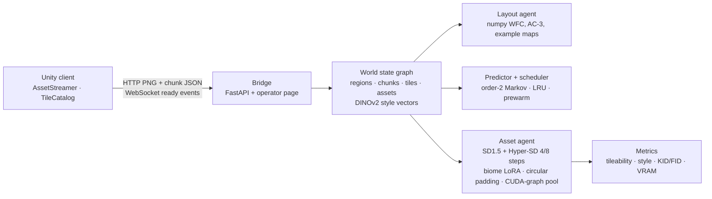

# RealmWeaver (MADWE) — Multi-Agent Diffusion World Engine

[](https://github.com/Sonica-B/RealmWeaver-MADWE/actions/workflows/ci.yml)

Coherent 2D game worlds on a laptop GPU: biome-styled, seamless textures from a few-step diffusion model, constraint-valid tile layouts from Wave Function Collapse, a world state graph that keeps style coherent across chunks, a predictor that pre-generates where the player is heading, and a bridge that streams it all into Unity. Every number below comes from a benchmark report in `reports/`, never from prose.



## Measured

<!-- bench-table:start -->
No benchmark report committed yet. Run `uv run realmweaver bench --n 50 --fid --pool-ab` and then `uv run python tools/report_table.py --write`.
<!-- bench-table:end -->

Caveats: the FID/KID reference set is the repo's own 240 SDXL-Turbo textures under `data/raw/textures` (the only reference available), so absolute FID is not comparable to papers; Unity frame-rate claims are out of scope until a Unity build is measured.

## Quickstart (60 seconds)

```bash
uv sync --extra dev                      # Python >= 3.11; CUDA torch on Windows, CPU torch on Linux CI
uv run realmweaver generate --biome forest --tile grass --out grass.png   # ~0.4 s on an RTX 5070 Ti, procedural fallback without CUDA
uv run realmweaver layout --biome desert --size 32 --seed 7 --out desert.png
uv run realmweaver world --biome snow --chunks 3 --out snow_world.png
uv run realmweaver serve                 # http://127.0.0.1:8008 operator page + API
uv run realmweaver bench --n 50 --fid --pool-ab   # writes reports/bench-<timestamp>.json
```

Docker with GPU (WSL2 backend on Windows, NVIDIA Container Toolkit on Linux):

```bash
docker compose build && docker compose up          # serves on :8008 with the GPU
docker compose run --rm realmweaver pytest -q -m "not gpu"
```

## How it works

- **Asset agent** (`realmweaver/assets`): `stable-diffusion-v1-5` fp16 at 512 px with `ByteDance/Hyper-SD` 4-step (draft) and 8-step CFG (refine) LoRAs, a rank-8 biome LoRA stacked on top (`realmweaver train-lora`), circular padding on every UNet/VAE convolution for seamless textures, and a memory pool that keeps latents, noise and prompt embeddings resident and replays the UNet step from a captured CUDA graph. Sprites are generated on white and alpha-keyed. A procedural generator sits behind the same `Generator` seam for CPU runs and tests.
- **Layout agent** (`realmweaver/layout`): simple-tiled WFC in numpy. Each biome ships a 12×12 ASCII example map in `realmweaver/biomes/<biome>/biome.yaml`; every adjacent pair in it is an allowed adjacency and frequencies become weights. AC-3 propagation, min-entropy observation, restart-then-shrink on contradiction, fixed border cells so chunks match their ready neighbours.
- **World state graph** (`realmweaver/world`): a networkx typed property graph (World → Region → Chunk → Tile → Asset) with DINOv2-small style vectors; coherence = 0.6·cos(asset, region style) + 0.4·mean cos(asset, adjacent assets); assets below the biome threshold are regenerated twice, then anchored to the region's best asset. Order-2 Markov predictor over eight headings ranks the next chunks; a byte-capped LRU scheduler keeps at most two generations in flight and prewarms draft tiles first.
- **Bridge** (`realmweaver/bridge`): FastAPI routes `GET /chunk/{cx}/{cy}`, `GET /asset/{id}.png`, `POST /generate`, `POST /player`, `GET /report`, `WS /events`, plus a single-page operator UI at `/`.
- **Unity** (`unity/com.realmweaver.client`): UPM package with `RealmWeaverClient`, `AssetStreamer`, `TileCatalog`, `ChunkRenderer`, `RealmWeaverEvents`; install via Package Manager → Add package from disk; see its README for the JSON contract.
- **Metrics** (`realmweaver/metrics`): tileability (wrapped-seam gradient ratio), Tiling Score, style consistency (within-biome minus cross-biome DINO cosine), KID + FID via torchmetrics, latency p50/p95, assets/min, VRAM peaks and allocator counters with the pool on and off.

## Models and licences

| Model | Role | Licence |
|---|---|---|
| `stable-diffusion-v1-5/stable-diffusion-v1-5` | base generator | CreativeML OpenRAIL-M |
| `ByteDance/Hyper-SD` (SD15 4-step, 8-step CFG LoRAs) | few-step inference | see model card (ByteDance OpenRAIL-style) |
| `facebook/dinov2-small` | style vectors | Apache-2.0 |
| `black-forest-labs/FLUX.2-klein-4B` (optional quality tier, not wired yet) | higher-quality assets behind the same seam | Apache-2.0 |

Biome LoRAs trained with `realmweaver train-lora` are yours. Generated assets inherit the base model's licence terms.

## Tests

```bash
REALMWEAVER_DEVICE=cpu uv run pytest -q -m "not gpu"   # CPU suite (also what CI runs)
uv run pytest -q -m gpu                                 # needs CUDA: generator, pool, LoRA round-trip
uv run ruff check realmweaver tests && uv run ruff format --check realmweaver tests
```

## Documents

- Design spec: `docs/superpowers/specs/2026-10-06-realmweaver-mvp-design.md`; implementation plan: `docs/superpowers/plans/2026-10-06-realmweaver-mvp.md`
- Decisions: `docs/adr/0001` few-step SD1.5 primary model · `0002` own WFC · `0003` HTTP+WebSocket bridge · `0004` graph as source of truth · `0005` measured-not-claimed · `0006` packaging
- Research: `docs/research/00-codebase-audit.md` (what the 2025 repo really contained), `01-model-landscape-2026.md`, `02-pcg-and-systems-literature.md`, `03-origin-unity-salvage.md`, `05-gpu-measurements.md`
- Vocabulary: `GLOSSARY.md`; standards: `CODING_STANDARDS.md`

## Security note

A Hugging Face access token was committed to this repository's history in July 2025 and later deleted from the files. It remains reachable in git history until the owner revokes it (huggingface.co/settings/tokens) and, optionally, rewrites history. CI now fails on secret-looking strings.

## Team

Shreya Boyane (AI models and generation) · Ankit Gole (architecture and integration). Apache-2.0, see `LICENSE`.
