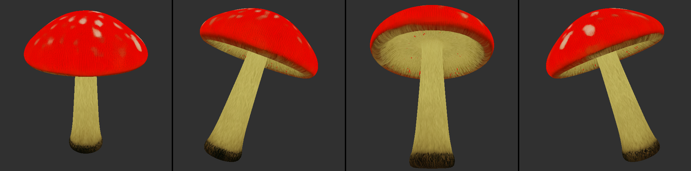
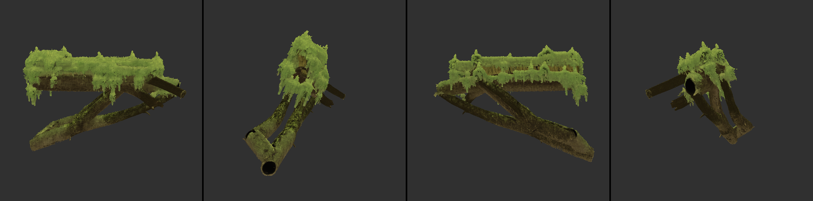
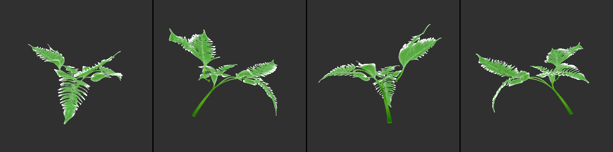
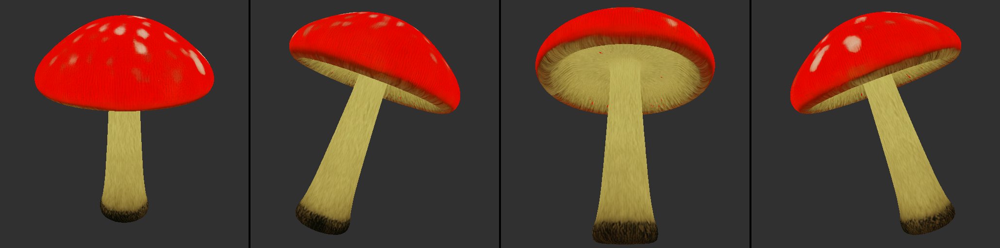
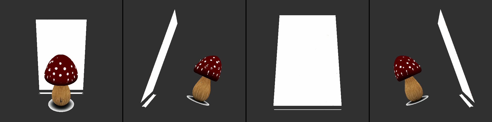

# 09 — TRELLIS.2 image → mesh + PBR spike on the laptop (Phase 0, E2; 2026-10-06)

Raw numbers only, per ADR-0005: everything below was measured on this machine with the commands shown. The research
claims being tested come from `07-generative-game-stack-2026.md` §1 and §8 (`microsoft/TRELLIS.2-4B` through ComfyUI
core nodes, "512³ in ~45-60 s on 8 GB `[M]`", "keep the 1 M-triangle decimation for Nanite") and §5 of
`docs/superpowers/specs/2026-10-06-emberfall-game-design.md`.

## 0. Verdict in one paragraph

**The recommended path works on Windows with no compiled CUDA extensions**: ComfyUI nightly (commit `0752bcb`,
2026-10-06) ships TRELLIS.2 as pure-torch core nodes, the `Comfy-Org/TRELLIS.2` int8 ConvRot repack is MIT and ungated,
and three forest props (mushroom, log, fern) went from our own SD1.5 sprites to GLBs with base-colour /
metallic-roughness (AO packed) / normal textures at 512³. **Generation (DINOv3 + three diffusion passes + two VAE
decodes) takes 49-80 s per prop**, which matches the research's "~1 min" figure; **the ComfyUI post-processing
(remesh → decimate → UV unwrap → bake) adds 84-232 s more** and is mostly CPU-bound, so the real cost at the template's
settings is 2.4-5.3 min per prop. **Peak VRAM depends on the post-processing settings and the voxel density, not on
generation alone**: at the template defaults (768³ remesh, 700 K faces, 4096² textures) the two dense assets (mushroom,
log) peak at 7.4-8.5 GB torch / 11.7-11.9 GB total on the 12.2 GB card; at a game-budget setting (512³ remesh, 50 K
faces, 2048² textures) the same mushroom peaks at 4.1 GB torch / 8.4 GB total and is visually identical in the
turntable. **Meshes are not watertight by design**
(35-737 open shells per asset), so collision must be generated in-engine. **Go for M0**, conditions in §7; the asset
path does not force Unreal: Nanite consumes the 700 K-triangle output directly, and the same graph emits a 50 K / 2 K
version for Unity in 2.4 min.

| image | asset (final run, BiRefNet mask) |
|---|---|
|  | `models/mesh-spike/mushroom.glb` — 699,289 tris, 52 MB, seed 42 |
|  | `models/mesh-spike/log.glb` — 697,946 tris, 74 MB |
|  | `models/mesh-spike/fern.glb` — 699,354 tris, 54 MB |
|  | `models/mesh-spike/mushroom_budget.glb` — 49,658 tris, 2048² textures, 11.5 MB (same seed as the first row) |
|  | first attempt with the sprite's own alpha as the mask: half-framed seed-0 sprite plus a stray alpha blob became a white slab (§5.4) |

Turntables are rendered in-graph by ComfyUI's `RenderMesh` (ray-cast, base-colour only, 20° tilt, 0/90/180/270°).

## 1. Environment

| item | value |
|---|---|
| GPU | NVIDIA GeForce RTX 5070 Ti Laptop GPU, 12227 MiB, driver 595.97 (CUDA 13.2 capable), WDDM, on AC power; 1.3-2.2 GB used by the desktop before any run |
| CPU / RAM / OS | Intel Core Ultra 9 285H, 32 GB RAM, Windows 11 Home 10.0.26200 |
| Install location | `D:\tools\ComfyUI` (git clone, commit `0752bcb28cd3`, 2026-10-06 16:29 -0400), own venv `D:\tools\ComfyUI\.venv` |
| Python / torch | 3.14.3 (uv-managed), **torch 2.11.0+cu128**, torchvision 0.26.0+cu128 (the wheels already in the uv cache) |
| ComfyUI deps | comfy-kitchen 0.2.37 (cp312-abi3 Windows wheel), comfy-aimdo 0.5.5, comfyui-frontend-package 1.53.10, comfyui-workflow-templates 0.11.77, transformers 5.19.0, safetensors 0.8.0, scipy 1.18.1, kornia 0.8.3, aiohttp 3.14.4; trimesh 5.1.1 + numpy 2.5.2 for validation |
| Model files (all public, no gated terms accepted) | `Comfy-Org/TRELLIS.2`: `diffusion_models/trellis_2_int8_convrot.safetensors` 5.25 GB, `vae/trellis_2_shape_vae_bf16.safetensors` 1.10 GB, `vae/trellis_2_texture_vae_bf16.safetensors` 0.95 GB, `clip_vision/dino_v3_vit_l.safetensors` 1.21 GB; `Comfy-Org/BiRefNet`: `background_removal/birefnet.safetensors` 0.44 GB. The bf16 checkpoint (10.3 GB), the 1024³ cascade and the official `microsoft/TRELLIS.2` repo were **not** run |
| Not available | `nvcc` (no CUDA toolkit installed — irrelevant for this path), triton (no Windows wheel), comfy-kitchen's CUDA backend (needs a cu130 torch; §5.2) |
| Concept images | `uv run realmweaver generate --biome forest --prop {mushroom,log,fern} --size 512 --seed N` (SD1.5 + Hyper-SD draft tier, 1.4-7.9 s each); the chosen seeds are in §3 |

Timeline: clone + venv + first mesh took 18 min (14:44 → 15:02) including the 8.5 GB of downloads; the whole spike with
the mask fix, re-generation of inputs and the four measured runs took ~85 min.

## 2. Install — the exact commands that worked

```powershell
# 1. ComfyUI nightly (TRELLIS.2 core nodes merged 2026-08-22; template "3d_pixal3d_trellis2_image_to_model")
mkdir D:\tools; cd D:\tools
git clone --depth 1 https://github.com/comfyanonymous/ComfyUI.git ComfyUI
cd D:\tools\ComfyUI

# 2. venv on the cached torch 2.11 cu128 wheels (Python 3.14 is what the cache holds; ComfyUI README: "3.14 works")
uv venv .venv --python 3.14
uv pip install --python .venv\Scripts\python.exe torch==2.11.0 torchvision==0.26.0 --index-url https://download.pytorch.org/whl/cu128
uv pip install --python .venv\Scripts\python.exe -r requirements.txt
uv pip install --python .venv\Scripts\python.exe trimesh          # validation only

# 3. weights (hf CLI from the repo venv; note: pass filenames POSITIONALLY, `--include` is ignored when filenames are given)
cd D:\WPI_Assignments\SideGigs\RealmWeaver-MADWE
uv run hf download Comfy-Org/TRELLIS.2 diffusion_models/trellis_2_int8_convrot.safetensors vae/trellis_2_shape_vae_bf16.safetensors vae/trellis_2_texture_vae_bf16.safetensors clip_vision/dino_v3_vit_l.safetensors --local-dir D:\tools\ComfyUI\models
uv run hf download Comfy-Org/BiRefNet background_removal/birefnet.safetensors --local-dir D:\tools\ComfyUI\models
# (the repo folder names equal ComfyUI's models/ sub-folders, so --local-dir models/ places every file correctly)

# 4. spike-only measurement node (torch.cuda peak stats from inside the server process)
copy tools\mesh-spike\vram_probe.py D:\tools\ComfyUI\custom_nodes\vram_probe.py

# 5. server (headless; the frontend is still served at http://127.0.0.1:8188 for inspection)
cd D:\tools\ComfyUI
.venv\Scripts\python.exe main.py --listen 127.0.0.1 --port 8188 --disable-auto-launch
```

Startup log worth knowing: `Total VRAM 12227 MB`, `Set vram state to: NORMAL_VRAM`, `cudaMallocAsync`,
`Using async weight offloading with 2 streams`, `Enabled pinned memory 12875.0`, and the warning
`WARNING: You need pytorch with cu130 or higher to use optimized CUDA operations` (§5.2).

## 3. Pipeline and the per-asset commands

The graph is the TRELLIS.2 branch of ComfyUI's shipped template `3d_pixal3d_trellis2_image_to_model.json`
(`comfyui_workflow_templates_json/templates/`), rebuilt in API format by `tools/mesh-spike/spike_run.py` so it runs
headless over `POST /prompt` + the websocket (per-node timings come from the `executing` events). Node chain and the
template's parameters, which were kept unless stated:

```
LoadImage ─► VRAMPeakReset ─► RemoveBackground(BiRefNet) ─► ImageCropToMask(1024², pad 1.0, black bg)
                             ─► Trellis2Conditioning(DINOv3 ViT-L)
UNETLoader(trellis_2_int8_convrot) ─► CFGOverride(1.0 from 66.7 %) ─► RescaleCFG 0.7 ─► ModelSamplingSD3 shift 5
   ─► KSampler(structure: 12 steps, cfg 7.5, euler/normal) ─► VaeDecodeStructureTrellis2(res 32)
   ─► Trellis2ShapeStage ─► KSampler(shape 512³: 20 steps, cfg 7.5; model = CFGOverride(1.0 from 76.9 %) + RescaleCFG 0.5)
   ─► VaeDecodeShapeTrellis ─► (mesh, shape_subdivides)
   ─► Trellis2TextureStage ─► KSampler(texture: 12 steps, cfg 1.0) ─► VaeDecodeTextureTrellis ─► voxel_colors
RemeshMesh(768, udf, smooth 20, drop<1 %) ─► DecimateMesh(700 000, midpoint) ─► MeshSmoothNormals(180°)
   ─► UnwrapMesh(pec, 4096, pad 1, weld 2e-4) ─► BakeTextureFromVoxel(4096, ref = raw VAE mesh) ─► base/metal/rough
   ─► BakeNormalMapFromMesh(2048, cage 0.05) + BakeAmbientOcclusion(1024, 64 samples, dist 0.71)
   ─► ApplyTextureToMesh ─► MeshSmoothNormals ─► VRAMPeakReport ─► SaveGLB(3d/spike/<name>)
   ─► RotateMesh ×4 ─► RenderMesh(texture, 512²) ─► ImageStitch ─► SaveImage (turntable)
```

Pure-512³ means no `Trellis2UpsampleStage` (the template's 1536 cascade); `--res 1024` in the runner adds it. The
Comfy repack holds four DiTs (structure, shape-512, shape-1024, texture-1024); the texture pass at 512 uses the single
texture DiT with `coord_resolution` 32, which is how the core node dispatches it (`comfy/ldm/trellis2/model.py`).

Per asset (ComfyUI venv python; inputs must be in `D:\tools\ComfyUI\input`):

```powershell
cd D:\WPI_Assignments\SideGigs\RealmWeaver-MADWE
uv run realmweaver generate --biome forest --prop mushroom --size 512 --seed 3 --out models\mesh-spike\concepts\forest_mushroom.png
uv run realmweaver generate --biome forest --prop log      --size 512 --seed 3 --out models\mesh-spike\concepts\forest_log.png
uv run realmweaver generate --biome forest --prop fern     --size 512 --seed 2 --out models\mesh-spike\concepts\forest_fern.png
copy models\mesh-spike\concepts\forest_*.png D:\tools\ComfyUI\input\

$py = "D:\tools\ComfyUI\.venv\Scripts\python.exe"
& $py tools\mesh-spike\spike_run.py --image forest_mushroom.png --name mushroom --mask birefnet --seed 42 --res 512 --tag cu128
& $py tools\mesh-spike\spike_run.py --image forest_log.png      --name log      --mask birefnet --seed 42 --res 512 --tag cu128
& $py tools\mesh-spike\spike_run.py --image forest_fern.png     --name fern     --mask birefnet --seed 42 --res 512 --tag cu128
# game-budget variant of the same generation
& $py tools\mesh-spike\spike_run.py --image forest_mushroom.png --name mushroom_budget --mask birefnet --seed 42 --res 512 --faces 50000 --tex 2048 --remesh-res 512 --tag cu128

# validation + tables
& $py tools\mesh-spike\spike_validate.py models\mesh-spike\mushroom.glb models\mesh-spike\log.glb models\mesh-spike\fern.glb models\mesh-spike\mushroom_budget.glb
& $py tools\mesh-spike\spike_table.py
```

The runner copies the GLB to `models/mesh-spike/<name>.glb`, the turntable to `docs/images/spike-mesh-<name>.png`, and
writes `models/mesh-spike/results/<name>_<tag>.json` (timings, probe, nvidia-smi samples) plus the exact API graph
(`*_graph_api.json`; one copy is checked in as `tools/mesh-spike/example_graph_api_mushroom.json`). Seeds: the
sprite seeds were picked by a framing sweep (§5.5); the TRELLIS.2 seed is 42 for every stage.

## 4. Measurements

Wall time is the runner's POST → completion time for the whole graph including the turntable. "cold" = first prompt
after a server start (DINOv3, the 5.25 GB DiT and both VAEs read from disk); "warm" = weights already cached by
ComfyUI's model manager. `torch peak` = `torch.cuda.max_memory_allocated / max_memory_reserved` inside the server
process (reset at `LoadImage`); `nvidia-smi` = whole-GPU `memory.used`, 1 s sampling, before the run and peak during it
(the baseline includes the desktop and ComfyUI's already-resident weights).

| asset | input (seed) | mask | wall s | gen s | post s | turntable s | torch peak alloc / reserved GB | nvidia-smi before -> peak MiB | peak stage |
|---|---|---|---|---|---|---|---|---|---|
| mushroom (final) | forest_mushroom.png (s3) | BiRefNet | 236.2 (cold) | 73.5 | 148.6 | 11.6 | 7.37 / 7.72 | 4044 -> 11669 | not attributed (runner v1) |
| log (final) | forest_log.png (s3) | BiRefNet | 320.7 (warm) | 79.5 | 232.2 | 8.6 | 8.49 / 8.81 | 2023 -> 11851 | not attributed (runner v1) |
| fern (final) | forest_fern.png (s2) | BiRefNet | 165.6 (warm) | 48.7 | 108.8 | 7.6 | 3.07 / 4.00 | 1548 -> 6904 | `ks_shape` (shape sampler) |
| mushroom, game budget (50 K / 2048² / remesh 512) | forest_mushroom.png (s3) | BiRefNet | 142.8 (warm) | 52.0 | 84.4 | 5.8 | 4.12 / 4.53 | 2092 -> 8430 | `ks_shape` 8430; `remesh` 7048; `dec_shape` 6952; `ks_ss` 6089; `decim` 5866; `bake_ao` 5369 |
| mushroom, attempt 1 (alpha mask, seed-0 sprite) | forest_mushroom_seed0.png | sprite alpha | 202.5 (cold) | 50.7 | 141.9 | 7.6 | 2.61 / 3.19 | 1955 -> 7167 | not attributed |

gen = BiRefNet + DINOv3 conditioning + three samplers + three VAE decodes; post = remesh … SaveGLB.

| asset | GLB MB | triangles | verts stored / merged | bbox extents x,y,z (unit cube) | watertight | shells | boundary edges | non-manifold edges | UV coverage | base colour / metal-rough(+AO in R) / normal px |
|---|---|---|---|---|---|---|---|---|---|---|
| mushroom (final) | 52.1 | 699,289 | 454,401 / 345,102 | 0.80 x 1.00 x 0.80 | no | 35 | 129 | 1,826 | 69.4 % | 4096 / 4096 / 2048 |
| log (final) | 73.9 | 697,946 | 637,145 / 334,200 | 1.00 x 0.73 x 0.53 | no | 737 | 560 | 3,737 | 78.6 % | 4096 / 4096 / 2048 |
| fern (final) | 54.4 | 699,354 | 484,540 / 346,881 | 0.92 x 0.73 x 1.00 | no (winding consistent) | 88 | 29 | 1,703 | 67.6 % | 4096 / 4096 / 2048 |
| mushroom, game budget | 11.5 | 49,658 | 39,505 / 23,919 | 0.80 x 1.00 x 0.80 | no | 7 | 54 | 106 | 59.1 % | 2048 / 2048 / 2048 |
| mushroom, attempt 1 | 49.0 | 698,843 | 527,336 / 346,367 | 0.61 x 0.98 x 0.69 | no | 75 | 103 | 1,300 | 72.0 % | 4096 / 4096 / 2048 |

Validation is `tools/mesh-spike/spike_validate.py` (trimesh 5.1.1): "stored" vertices are what the GLB carries (UV
seams and the normal split duplicate them), "merged" is after position-only welding, and watertightness, shells and
edge counts are computed on the merged mesh. UV coverage = fraction of the atlas covered by UV triangles rasterised at
1024². All four materials are glTF `pbrMetallicRoughness` with `metallicFactor = roughnessFactor = 1.0` and the AO in
the R channel of the metallic-roughness image (ORM packing by ComfyUI's `SaveGLB`); no emissive.

Per-stage seconds (websocket `executing` events; raw mesh = the VAE output before remeshing):

| asset | raw VAE mesh | bg_mask | cond | ks_ss | dec_ss | ks_shape | dec_shape | ks_tex | dec_tex | remesh | decim | unwrap | bake_tex | bake_nrm | bake_ao | save |
|---|---|---|---|---|---|---|---|---|---|---|---|---|---|---|---|---|
| mushroom (final) | 1.15 M v / 2.31 M f | 0.7 | 3.8 | 22.7 | 1.7 | 27.6 | 2.4 | 12.7 | 2.0 | 12.8 | 13.3 | 24.0 | 29.6 | 12.6 | 50.6 | 4.1 |
| log (final) | 2.20 M v / 5.56 M f | 1.7 | 3.7 | 30.6 | 0.8 | 26.8 | 1.7 | 12.6 | 1.7 | 13.9 | 7.2 | 96.0 | 28.8 | 10.9 | 67.7 | 5.6 |
| fern (final) | 0.19 M v / 0.37 M f | 1.7 | 3.5 | 20.2 | 0.8 | 13.5 | 1.1 | 7.3 | 0.7 | 2.7 | 1.8 | 25.8 | 18.2 | 12.0 | 42.4 | 4.3 |
| mushroom, budget | 1.16 M v / 2.31 M f | 0.6 | 1.1 | 17.3 | 0.4 | 21.6 | 1.2 | 8.8 | 1.1 | 6.0 | 4.4 | 3.7 | 22.4 | 11.5 | 35.1 | 1.2 |
| mushroom, attempt 1 | 0.39 M v / 0.76 M f | – | 3.6 | 19.2 | 1.3 | 14.9 | 1.6 | 8.1 | 2.1 | 4.9 | 3.4 | 56.8 | 21.2 | 9.9 | 39.9 | 3.9 |

Readings:

- **Generation is 49-80 s at 512³** on the int8 ConvRot checkpoint through comfy-kitchen's *eager* backend (§5.2).
  The research's "512³ ~45-60 s on 8 GB `[M]`" was for generation only and holds here; the two samplers scale with the
  number of active voxels (log: 30.6 + 26.8 s; fern: 20.2 + 13.5 s).
- **Post-processing dominates**: 84-232 s. `UnwrapMesh` (PEC segmentation on GPU, parameterisation in numpy on CPU)
  and `BakeAmbientOcclusion` (numpy ray-caster, 64 samples) are 50-70 % of it and do not scale with the GPU; at the
  budget settings the unwrap drops from 24-96 s to 3.7 s.
- **Decimation target is a ceiling, not a target**: the 768³ remesh produces > 700 K faces for every asset, including
  the 369 K-face fern, so all three finals land at 698-699 K triangles. The remesh resolution should follow the
  generation resolution (512) unless a hero asset is being upsampled.
- **VRAM**: generation peaks at 6.3 GB above idle for a dense object (budget run, `ks_shape`); the template's 768³
  remesh + 4096² bakes push the process to 7.4-8.5 GB allocated and the GPU to 11.7-11.9 GB of 12.2 GB. At template
  settings there is **no room for a co-resident 4 GB LLM**; at budget settings the process peaks at ~6.3 GB above the
  desktop, which leaves ~4 GB.
- **Scale**: outputs are normalised to a unit cube centred at the origin, Y-up (ComfyUI rotates TRELLIS.2's Z-up
  frame on decode); the engine importer must apply real-world size per prop class.
- **Topology**: every asset is a set of open shells (O-Voxel + UDF dual contouring): 35 / 737 / 88 shells, 29-560
  boundary edges, 1.7-3.7 K non-manifold edges; the log's 737 shells are the moss fringes, the branch ends are open
  tubes (visible in the turntable). This is what the research predicted — fine for Nanite rendering, useless for
  collision without an in-engine hull.
- **Thin foliage**: the fern's base colour has white fringes at leaf edges (1 px UV padding at 4096 plus the texture
  VAE's alpha channel being baked as colour, not as cut-out alpha); needs `UnwrapMesh` padding > 1 or an alpha-cutout
  material before foliage goes in a biome.
- **Cold vs warm**: the first prompt after a server start costs ~50 s more (mushroom final 236 s cold vs the same
  generation 143 s warm in the budget run with lighter post-processing; conditioning 3.8 s cold vs 1.1 s warm).
- **Throughput at this laptop**: serial, GPU otherwise idle, 1,000 props ≈ 65-85 h at template settings (4-5.3 min
  each) or ≈ 40 h at budget settings (2.4 min each); the research's "a day of unattended generation" assumed
  generation-only time (49-80 s → 14-22 h). Running the CPU-bound unwrap/bake in parallel with the next asset's GPU generation (two
  ComfyUI queues, or a separate bake worker) is the obvious 2× and was not tested.

## 5. Problems and workarounds

1. **`hf download` silently ignored `--include`** when filenames follow it ("Ignoring `--include` since filenames
   have been explicitly set"), so the 5.25 GB DiT was not queued on the first attempt. Pass every file positionally
   (§2) or use `--include` alone.
2. **comfy-kitchen's CUDA backend is disabled on torch cu128**: the server logs `Found comfy_kitchen backend cuda:
   {'available': True, 'disabled': True, ...}` and "You need pytorch with cu130 or higher to use optimized CUDA
   operations"; the int8 ConvRot dequantisation therefore runs through the eager backend. Everything works; the cu130
   wheel (~3 GB, `torch==2.11.0+cu130`) was not installed because the whole project is on cu128 and the budget was
   spent on the pipeline. Re-measure once before M0: it is the one cheap speed knob left.
3. **`LoadImage` returns `1 - alpha` as the mask**, so a sprite's alpha has to go through `InvertMask` before
   `ImageCropToMask` (the runner's `--mask alpha` path).
4. **The SD1.5 sprites' alpha is not a clean matte**: binary, but with 2-56 extra opaque components per sprite (seed-0
   mushroom: 35.6 K px object + 10.3 K + 9.9 K px background blobs). Attempt 1 fed that alpha and TRELLIS.2 faithfully
   modelled a white slab next to the mushroom (last image in §0). Fix = the template's own path: **BiRefNet
   salient-object matting on the RGB** (`RemoveBackground` node, 0.44 GB model, 0.6-1.7 s), which also dropped the
   grass patches around the log. The dirty masks also inflate the raw mesh (seed-0 log: 7.09 M faces, QEM at
   2.5 s/iteration) — the run that the first session died in.
5. **The sprite generator composes props against the frame edge**: in a sweep of 6 seeds per prop (14 for the log)
   only mushroom 2/6, fern 3/6 and log 3/14 had the main alpha component clear of all four borders; a cut-off subject
   becomes a half object in 3D. Picked seeds: mushroom 3, fern 2, log 3 (the log touches the left edge; that end
   became a flat sawn face, acceptable). For the sprite → 3D step the generator needs a framing check (bbox margin ≥ 8
   px) or a re-roll loop; the seed-0 sprites are kept as `models/mesh-spike/concepts/forest_*_seed0.png`.
6. **Template defaults are sized for its 1536³ cascade** (remesh 768, 700 K faces, 4096² textures, 2048² normals,
   1024² AO): at 512³ they triple the time, cap every asset at 700 K triangles and produce 52-74 MB GLBs. The budget
   row (remesh 512, 50 K faces, 2048²) is the prop default to carry into M0; keep the template values for hero assets
   and 1024³ cascades.
7. **Run ComfyUI as a detached service for batches.** The server was a child of the agent shell; when the first session
   ended, the server, the running log job and the queued jobs died with it. For the content factory start it with
   `Start-Process`/Task Scheduler (or NSSM) and let the sidecar talk HTTP, which is also the GPL boundary (§6).
8. **`Save3DAdvanced` needs the frontend's `viewport_state`** (a `LOAD_3D` widget), so it cannot be used from the API;
   `SaveGLB` takes the `MESH` directly and writes the full PBR GLB. Dynamic-combo inputs are addressed as
   `sign_mode.qef`, `mode.angle_y` etc. in API JSON.
9. **Python 3.14 works** with this ComfyUI commit (README: "works but some custom nodes may have issues"); comfy-kitchen
   ships a cp312-abi3 Windows wheel, triton has no Windows wheel (expected, only affects the triton backend).
10. **VRAM headroom**: with another agent holding 4 GB, the template-setting runs (11.7-11.9 GB total) would have
    failed; `--reserve-vram 4` on the server or the budget settings are the mitigations. No OOM occurred in the spike
    because nothing else was resident (verified with `nvidia-smi --query-compute-apps`).
11. **GLB vertex counts are 1.3-1.9× the welded counts** (UV seams, normal split), which matters for memory budgets and
    for any 16-bit-index import path; sizes above are of the PNG-embedded GLBs (`SaveGLB` writes PNG, not WebP/KTX2).

## 6. Licence note

| component | licence | consequence |
|---|---|---|
| `microsoft/TRELLIS.2-4B` weights | MIT (HF card, repo LICENSE) | outputs unrestricted; keep the provenance record (model, licence, seed, prompt) per spec §5 |
| `Comfy-Org/TRELLIS.2` repack (int8 ConvRot DiT, VAEs) | MIT (HF card) | same |
| DINOv3 ViT-L/16 image encoder inside the repack (`clip_vision/dino_v3_vit_l.safetensors`) | **Meta DINOv3 License** (not MIT): commercial use permitted, no user/revenue cap, prohibits military/ITAR/sanctioned uses, derivative distribution only under the same terms with the licence text, attribution in publications | we ship meshes, not weights, so nothing changes for the game; do not redistribute the repack without its licence; the official `facebook/dinov3-*` repos are gated — the Comfy repack is the ungated route and is the only reason no gated terms had to be accepted |
| `Comfy-Org/BiRefNet` (base `ZhengPeng7/BiRefNet`) | MIT | none |
| ComfyUI | GPL-3.0 | keep it an **external process** behind its HTTP API (as in this spike); never import ComfyUI code into `realmweaver`; the spike probe node and runner are tooling, not shipped code |
| SD1.5 concept sprites (existing path) | CreativeML OpenRAIL-M | unchanged |
| Official `microsoft/TRELLIS.2` repo deps (nvdiffrast, nvdiffrec, FlexGEMM, O-Voxel, CuMesh) | NVIDIA source-code licences etc. | **not used** — the ComfyUI path is pure torch, which is also why it installs on Windows without `nvcc` |

## 7. Go / no-go for M0 — Unreal Nanite vs Unity

**GO (conditional) for `microsoft/TRELLIS.2-4B` via ComfyUI core nodes as the M0 prop pipeline on this laptop.**

Conditions that go into the E2 tickets:

1. Input hygiene before image-to-3D: BiRefNet matting (template path) and a framing check on the sprite; both are
   cheap and both failures were observed (§5.4, §5.5).
2. Two output profiles from the same graph: **prop** (remesh 512, ≤ 50 K faces, 2048² ORM/normal; 2.4 min, 11.5 MB,
   ≤ 8.4 GB GPU total) and **hero** (template values or the 1024³ cascade; 4-5 min, 50-75 MB, needs the GPU alone).
3. Collision generated in-engine (auto-convex / simplified hull); the meshes are open shells by design.
4. ComfyUI runs as a service with a bounded queue; the sidecar submits API-format graphs exactly as the runner does.
5. Measure once with a cu130 torch (comfy-kitchen CUDA kernels) and once with the bf16 checkpoint before freezing the
   per-asset time in the content-factory budget.

**Engine implication: the asset path does not decide the engine.**

- *Unreal 5.8 + Nanite*: the hero profile (700 K triangles, 4 K PBR) imports as a Nanite mesh with no retopology or LOD
  work, exactly as `07-…` §1.3 argued; the costs are 50-75 MB per GLB before texture compression (1,000 props ≈ 60 GB
  of source, so BC7/KTX2 and a 2 K default are mandatory anyway) and the 1.3-1.9× vertex split.
- *Unity 6.3*: the prop profile (50 K triangles, 2 K) renders through the normal pipeline and looked identical to the
  700 K version in the turntable at prop scale; LOD1-3 are extra `DecimateMesh` passes (4-13 s each at this size) or
  `gltfpack`, and the same collision rule applies. Unity does not need Nanite for props of this quality; it would only
  lose on hero assets and on dense foliage, where the open-shell meshes and the fern's edge fringes would need the
  alpha-cutout work regardless of engine.

So the engine choice should rest on the §5.1 runtime criteria of `07-…` (streaming, PCG, motion matching, cook time,
bridge port), not on TRELLIS.2 compatibility; the content factory should emit both profiles from day one so the
decision stays reversible.

## 8. Not done / measure next

- torch cu130 (comfy-kitchen CUDA backend) and the bf16 checkpoint: p50/p95 at 512³ (validation plan item 2 of `07-…`).
- 1024³ cascade on this card (`--res 1024`; the research's 16 GB figure suggests partial offload) and TripoSG as the
  watertight fallback — not started, TRELLIS.2 did not fail.
- DINOv2 coherence score of the turntables against the sprite (the style gate in E2) and the operator-page preview.
- Parallel bake worker to overlap the CPU-bound unwrap/AO with the next generation.
- An engine import test: no Unreal or Unity editor is installed on this machine (owner decision in spec §9.6).

Files: `models/mesh-spike/{mushroom,log,fern,mushroom_budget,mushroom_attempt1_alphamask}.glb` (+ `.validation.json`,
`concepts/`, `results/`; folder is gitignored), `docs/images/spike-mesh-*.png`, `tools/mesh-spike/`
(`spike_run.py`, `spike_validate.py`, `spike_table.py`, `vram_probe.py`, `example_graph_api_mushroom.json`),
`D:\tools\ComfyUI` (install, outside the repo).
