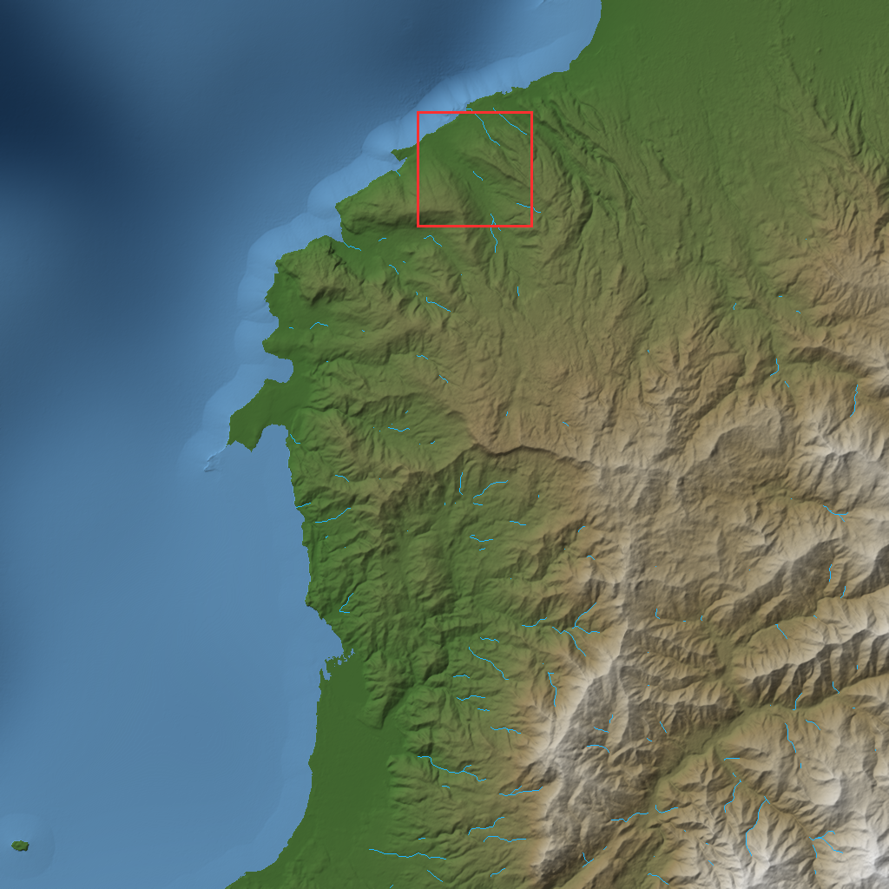
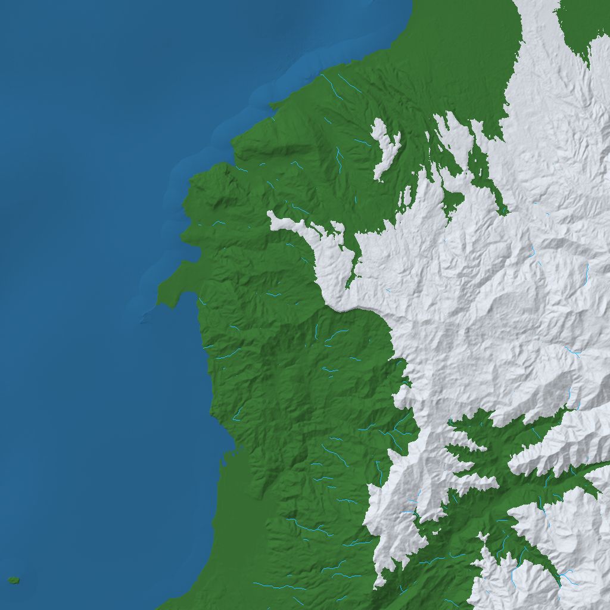
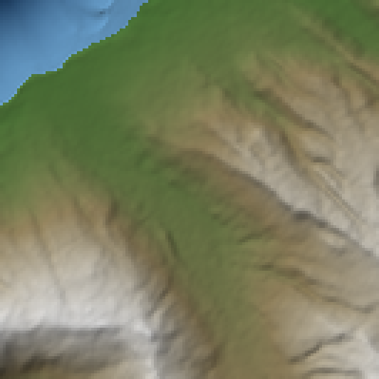
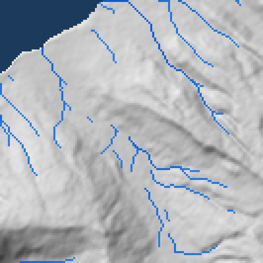
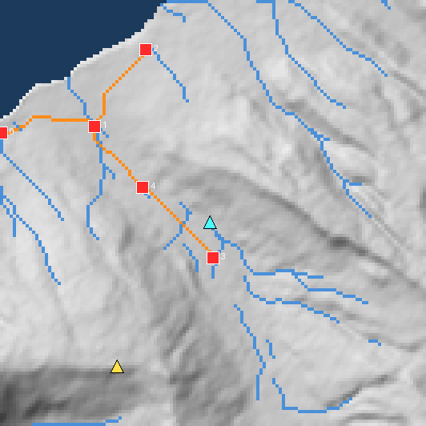
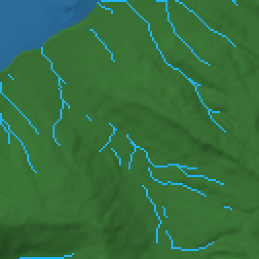
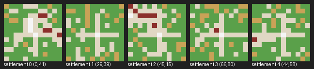
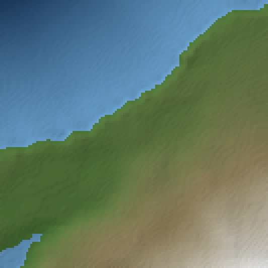

# 12 — terrain-diffusion-30m → rivers / roads / biomes → world graph spike (Phase 0, E3; 2026-10-06)

Raw numbers only, per ADR-0005: everything below was measured on this machine with the commands shown. The claims
being tested come from `07-generative-game-stack-2026.md` §2 and §8 ("seed-consistent O(1) random access",
"`[E]` < 6 GB", "Terrain Diffusion 30 m → Python post-pass (rivers, roads, Whittaker biomes, WFC settlements) →
world graph") and §5 of `docs/superpowers/specs/2026-10-06-emberfall-game-design.md`; the ticket is #30. The
ticket's "4 km²" region is read as a 4 km × 4 km window (133 × 133 cells at 30 m), its "1 km²" as 1 km × 1 km
(133 × 133 at 7.5 m).

## 0. Verdict in one paragraph

**The diffusion heightmap source ran; the noise fallback is only the test double.** `xandergos/terrain-diffusion-30m`
(MIT; a diffusers-format `WorldPipeline` of three `EDMUnet2D`s: coarse 11 MB, base 1.01 GB, decoder 112 MB) runs on
the laptop in its own venv (Python 3.12 — the 3.14 venv died on `pyfastnoiselite`, which has no cp314 wheel) behind
the repo's own Flask API, which `realmweaver.terrain.DiffusionHeightmap` reads over HTTP with the standard library.
A cold 1024 × 1024 tile (30.7 km side at 30 m/px) takes **8.6 s**, a warm one 0.20 s, and the server holds
**≈3.45 GB of VRAM** (≈3.9 GB total on the card), under the 6 GB cap. **Seed consistency holds; naive random access
does not**: an all-land or all-sea sub-window is the exact crop of a larger window (0 cells differ, 1 m flicker on a
few border cells), but a coastal sub-window differs by **up to 9 m (mean 1.7 m, 63–81 % of its cells)** and a
384-cell margin still leaves 46 % of cells off, because `WorldPipeline._compute_elev` runs `laplacian_denoise` over
the *requested* window. Sampling through fixed 1024-cell aligned tiles makes every request for a cell byte-identical,
so the adapter does that by default. The numpy post-pass — D8 rivers weighted by the model's precipitation, roads as
slope-cost Dijkstra paths along the settlements' Euclidean MST, a Whittaker table over the model's temperature and
precipitation, flat-near-water settlement sites, WFC village layouts, summit and river-mouth landmarks — takes
**≤ 0.09 s per step on the 133² region** (0.56 s for rivers on the 1024² tile) and `write_region` leaves
`WorldStateGraph.validate()` empty with 1 Region3D, 2 Region, 5 Settlement and 2 Landmark records, 10 CONTAINS and
10 ADJACENT edges, round-tripping through node-link JSON (7.5 KB). **Go for M0**, with the tiling rule, int16-metre
elevation and D8 without depression filling as the known ceilings (§7).

| | |
|---|---|
|  | 1024 × 1024 cells at 30 m (30.7 km side), seed 42, cells x ∈ [1024, 2048), y ∈ [0, 1024): hillshaded height, D8 rivers (≥ 1000 cells of mean rain), the 133² region in red |
|  | the same tile through the Whittaker table: forest 34.6 %, snow 27.2 % (cells below 3 °C, which this wet corner reaches only at altitude), underwater 38.2 %; desert, volcanic and sky 0 % (791–2597 mm, −1.2–17.2 °C, max 2096 m) |

| region image (133 × 133 at 30 m, rendered ×4) | what it shows |
|---|---|
|  | height −483..616 m, the north coast of the tile at cells (1504, 128) |
|  | D8 rivers, accumulation ≥ 200 cells of precipitation-weighted rain: 567 river cells (3.2 %), 47 land sinks |
|  | 5 settlement sites (red), 4 least-cost roads (orange, Euclidean MST), the summit (yellow) and the river mouth (cyan) landmarks |
|  | Whittaker classes: forest 94.3 %, underwater 5.7 % (3.1–7.2 °C, 1219–1568 mm, nothing above 2500 m or below 3 °C) |
|  | the five 12 × 12 WFC village layouts: plaza fixed at the centre with a road cross, houses (red) only along roads, fields (tan) outside; 0 adjacency violations |
|  | 1 km × 1 km at 7.5 m around settlement 0: the server's bilinear upsample of 30 m data, no new detail, and 1 m terraces from the int16 wire format |

Local assets (not committed, `models/` is gitignored): `models/terrain-spike/region-height-30m.png` and
`overview-height-30m.png` (16-bit, value = metres + 32768), `region-rivers-mask.png`, `region-roads-mask.png`,
`region-biome-index.png` (index into `BIOMES`), `world-graph.json` (the `WorldStateGraph.to_json()` of the written
region) and `spike-summary.json` (every number quoted here).

## 1. Environment

| item | value |
|---|---|
| GPU | NVIDIA GeForce RTX 5070 Ti Laptop GPU, 12227 MiB; 466 MiB used by the desktop before the server started (all VRAM figures below subtract it; nvidia-smi on WDDM reports no per-process memory) |
| CPU / RAM / OS | Intel Core Ultra 9 285H, 32 GB, Windows 11 Home 10.0.26200 |
| Model repo | `D:\tools\terrain-diffusion` (git clone of `xandergos/terrain-diffusion`, `e8dcb4b`, 2026-08-11), own venv `.venv` |
| Venv | Python 3.12.12 (uv-managed), torch 2.11.0+cu128, torchvision 0.26.0+cu128, diffusers 0.41.0, infinite-tensor 0.3.0, numba 0.68.0, rasterio 1.5.2, scikit-image 0.26.0, pyfastnoiselite 0.0.6, h5py, matplotlib, scipy, ema-pytorch, flask |
| Weights | `xandergos/terrain-diffusion-30m` in the HF cache, 1.1 GB (`base_model` 1,014,772,076 B, `decoder_model` 111,709,108 B, `coarse_model` 11,200,936 B, all `.safetensors`); MIT, ungated |
| Data the synthetic coarse map needs | `data/global/etopo_10m.tif` (ships with the clone) + WorldClim 2.1 bio 1/4/12/15 at 10′ (`wc2.1_10m_bio.zip`, 49.9 MB, CC-BY-4.0); the first `bind()` writes `data/global/synthetic_map_stats.json` and later starts hit the cache |
| Repo side | `realmweaver.terrain` on the repo's uv env (Python 3.14.3, numpy 2.5.3); no dependency added to `pyproject.toml` |
| Other GPU tenants | none during the runs (the NPC spike was not resident) |

Timeline: clone + venv + first window took 25 min (the 3.14 venv detour and the 2.8 GB cp312 torch download
included); the whole spike, with the random-access investigation, took ~2 h 20 min.

## 2. Install — the exact commands that worked

```powershell
git clone --depth 1 https://github.com/xandergos/terrain-diffusion D:\tools\terrain-diffusion
uv venv D:\tools\terrain-diffusion\.venv --python 3.12 --clear
uv pip install --python D:\tools\terrain-diffusion\.venv\Scripts\python.exe --index https://download.pytorch.org/whl/cu128 --index-strategy unsafe-best-match torch==2.11.0 torchvision==0.26.0
uv pip install --python D:\tools\terrain-diffusion\.venv\Scripts\python.exe "diffusers>=0.30.3" "infinite-tensor>=0.3.0" h5py matplotlib scikit-image scipy numba pyfastnoiselite==0.0.6 rasterio ema-pytorch flask click tqdm safetensors pillow
# WorldClim: without these four TIFFs synthetic_map.py calls input() on first bind and a server hangs
curl -L -o D:\tools\terrain-diffusion\data\global\wc2.1_10m_bio.zip https://geodata.ucdavis.edu/climate/worldclim/2_1/base/wc2.1_10m_bio.zip
# extract wc2.1_10m_bio_1.tif, _4, _12, _15 into D:\tools\terrain-diffusion\data\global
cd D:\tools\terrain-diffusion
.venv\Scripts\python.exe -m terrain_diffusion.inference.api xandergos/terrain-diffusion-30m --seed 42 --port 8765 --host 127.0.0.1 --no-compile --log-mode info --batch-size 1,4
```

Notes: the documented entry `python -m terrain_diffusion api` imports the training stack (wandb, optuna,
earthengine-api, …) through `__main__.py`; `-m terrain_diffusion.inference.api` needs only the list above.
`requirements.txt` pins nothing, so versions are whatever resolved on 2026-10-06. `--no-compile` is moot: the
pipeline disables `torch.compile` on Windows itself. The 3.14 venv was abandoned because uv found cp36–cp313 wheels
only for `pyfastnoiselite` (the Perlin stack behind the coarse map). The server answers `/health` 14–19 s after
launch (three restarts: 14, 18, 19 s), fp32 weights.

## 3. What the pipeline gives and how the adapter reads it

`WorldPipeline.from_pretrained(repo, seed=…, caching_strategy="direct").to("cuda").bind()` then
`get(i1, j1, i2, j2)` → `elev` (H, W) float32 metres and `climate` (5, H, W): elevation-adjusted mean temperature
°C, temperature seasonality, annual precipitation mm, precipitation CV, local lapse β. The API server floors elevation
to **int16 metres** and ships temp, t_season, precip, p_cv as float32 (`GET /terrain?i1&j1&i2&j2&scale&seed`;
`i` is the row). Geometry: 30 m per fine cell; coarse map 7.7 km per cell (= 256 fine cells); latents at 8×
compression (240 m); decoder tiles 512 px with stride 384, latent tiles 64 with stride 32, coarse tiles 64 with stride
48; every tile's noise is a portable PCG64 hash of (seed, tile), so the world is a pure function of the seed. `scale=4`
is a bilinear upsample on the server (the 7.5 m window above).

`realmweaver.terrain.DiffusionHeightmap(url, seed, scale=1, tile=1024)` fetches the aligned tiles covering a window
and crops (`tile=None` requests the exact window), returning `Terrain(height, temperature, moisture, cell_m, x0, y0)`
with `moisture` = annual precipitation. `NoiseHeightmap(seed)` returns the same record from hashed-lattice value-noise
fBm (exact random access by construction) for the CPU tests.

## 4. Measurements

Timings, final run after a server restart (`models/terrain-spike/spike-summary.json`), wall-clock on the client:

| step | window | seconds |
|---|---|---|
| server launch → `/health` | — | 19 |
| cold exact window | 133² (4 km) | 5.1 |
| warm exact window (server cache) | 133² | 0.01 |
| cold exact window | 512² (15.4 km) | 4.9 |
| cold aligned tile | 1024² (30.7 km) | 8.6 |
| warm aligned tile (19 MB over HTTP) | 1024² | 0.20 |
| region through its tile, warm | 133² | 0.16 |
| 7.5 m window (`scale=4`), warm | 133² (1 km) | 0.13 |
| `rivers` (D8 + accumulation) | 1024² | 0.56 |
| `rivers` / `biomes` / `settlement_sites` / `roads` / 5 × `settlement_layout` / `write_region` | 133² | 0.011 / < 0.001 / 0.001 / 0.043 / 0.087 / 0.062 |

The cold cost is dominated by the latent stage (the 1 GB base model over 64-latent tiles with stride 32) and barely
grows from 133² to 512², so fetching whole 1024² tiles costs little more than small windows; an earlier run before
any CUDA warm-up measured 6.9 s for the first 133² window.

VRAM (total minus the 466 MiB desktop baseline): 1.28 GB after loading the weights; 3.47 GB after the first window;
3.45–3.46 GB after the 512² and 1024² windows and at the end — the pool does not grow with window size. Card total
≈ 3.9 GB. Research estimate "`[E]` < 6 GB" holds with 2.5 GB to spare; the M0 budget of 6 GB for the game plus
3.5 GB for the LLM cannot host this at play time, which is fine: terrain is pre-baked (§8 of the research doc).

Random access, seed 42 — a window requested on its own versus the crop of a 1024² window containing it:

| sub-window (within tile origin) | content | cells differing | max |
|---|---|---|---|
| (200, 200) + 133² in tile (−512, −3072) | all land | 0 % (3 % of cells within 8 px of the border, by 1 m) | 1 m |
| (100, 700) + 133² in the same tile | all sea | 0 % | 0 m |
| (600, 150) + 133² in the same tile | land | 0 % | 1 m |
| (300, 400) + 133² in the same tile | coast | 81 %, mean +1.7 m | 9 m; temperature differs by ≤ 0.09 °C through the lapse term, precipitation identical |
| the same with a 128 / 192 / 256 / 384-cell margin cropped away | coast | 67 / 60 / 55 / 46 % | 5 / 5 / 4 / 4 m |
| (300, 400) + 133² in tile (1024, 0) (the overview above) | coast | 63 % | 9 m |
| any of these through 1024-cell aligned tiles | — | 0 % | 0 m |

Cause, from `terrain_diffusion/inference/world_pipeline.py::_compute_elev` and `data/laplacian_encoder.py`: the
decoder residual and the latent low band are fetched for the padded request window, then `laplacian_denoise` decodes
them and re-encodes the low band with `TF.resize(decoded, lowres.shape[-1])` plus a Gaussian blur of σ = 5 latent
cells over that window, so the low band — hence every cell — depends on the window's extent; windows that are all
land or all sea come out identical because their low band is smooth, mixed windows do not. The infinite-tensor stages
underneath are consistent (the library processes every tile intersecting a request), which is why fixed aligned tiles
restore byte-identical reads. Repeating the same request always returns the same bytes (checked on every window).

## 5. The post-pass on the region (`realmweaver/terrain/postpass.py`)

- **Rivers**: D8 steepest descent per unit distance, strictly downhill (a cell with no lower neighbour is a sink),
  accumulation in descending-height order weighted by precipitation / its mean, river where the accumulation reaches
  the threshold above sea level. Region: 567 river cells at threshold 200, 47 land sinks (pits and flats; the 1 m
  quantisation makes gentle slopes flat). The "river mouth" landmark is the river cell with the largest accumulation,
  (65, 69) at 127 m: it ends in a pit, not at the coast, which is the depression-filling ceiling made visible.
- **Biomes**: `BIOMES = (desert, forest, sky, snow, underwater, volcanic)` (= `sorted(biome_names())`); first match
  wins: snow below 3 °C, desert below 250 mm, volcanic at ≥ 20 °C and < 600 mm (Whittaker's hot shrubland band as our
  basalt look), forest otherwise; underwater at or below 0 m and sky above 2500 m override. Shares sum to 1 by
  construction and the tests show snow growing when the temperature field drops.
- **Settlement sites**: 3 × 3 mean slope ≤ 0.10, a river or sea cell within 6 cells (Chebyshev), above sea level and
  off the water, ≥ 15 cells apart, score = flatness + ½ water proximity. 5 of 5 found at slopes 0.025–0.055, all one
  cell from water, 21–159 m.
- **Roads**: one Dijkstra path per Euclidean-MST edge on the 8-connected grid, step cost = length × (1 + (slope /
  0.1)²), × 4 on a river cell, sea impassable. 4 roads of 21–30 cells (0.63–0.90 km), flat-equivalent costs
  0.96–1.36 km, all reachable (the straight-line fallback never fired); 97 road cells in the region.
- **Villages**: `tileset_from_example` over a 12 × 10 example map whose houses touch only roads and houses, hand
  weights (grass .40, field .15, road .15, house .27, plaza .03 — the learned counts over-weight road and starve
  houses), plaza fixed at the centre with a 9-cell road cross, `solve(12, 12, seed folded with the site's cell)`;
  0 adjacency violations, 0.017 s per village.
- **Landmarks**: the summit (36, 114) at 616 m and the river mouth above.

## 6. The graph write (`realmweaver/terrain/to_graph.py`)

`write_region(graph, "emberfall-spike", biome_map, rivers, roads, sites, layouts=…, landmarks=…, cell_m=30,
provenance=…)` added, through `WorldStateGraph`'s public `add_region`/`region` for the Regions and a minimal
`_add_node(kind, parent, **attrs)` for the kinds the graph has no record for yet (ids `kind:name`, plain-JSON
attributes, one CONTAINS parent, ADJACENT both ways with `dir`):

| node | count | CONTAINS parent | attributes |
|---|---|---|---|
| `region3d:emberfall-spike` | 1 | World | cells [133, 133], cell_m, biome_shares, river_cells 567, road_cells 97, provenance {model, licence, seed, window_cells, cell_m} |
| `region:emberfall-spike/{forest,underwater}` | 2 | World (via `add_region`) | biome; ADJACENT to each other where their patches touch, `dir` from the centroid bearing |
| `settlement:emberfall-spike/{0..4}` | 5 | Region3D | x, y, height_m, slope, water_cells, biome, layout {classes, 12 × 12 grid}; ADJACENT along each road with `road_cells` and `cost` |
| `landmark:emberfall-spike/{0,1}` | 2 | Region3D | category (summit, river_mouth), x, y, height_m, biome |

`validate()` → `[]` (the new kinds are outside its parent table; the Regions pass it), `count()` works per kind, and
`WorldStateGraph.from_json(to_json())` rebuilds the graph (7,490 B). `graph.py` was not touched.

## 7. Ceilings (each carries a `# ponytail:` in code) and the M0 path

1. **Random access only through aligned tiles** (§4): keep `tile=1024` as the sector size, or run a worker in the
   model's venv that returns float32 elevation denoised per fixed tile; the climate layers are safe at any window.
2. **int16 metres on the wire**: 1 m terraces (visible in the 7.5 m render) and flats that stop D8; the same float32
   worker fixes it.
3. **D8 without depression filling**: 47 sinks on 133², the biggest river ends in a pit; priority-flood (Barnes 2014)
   with numba, and run the river pass on the whole 1024² tile and crop — a 4 km region is a quarter of one coarse cell
   and has no upstream context of its own (the overview rivers took 0.56 s).
4. **Pure-Python Dijkstra**: 0.04 s for 4 roads on 133², slow past 512²; `scipy.sparse.csgraph` or coarse-to-fine.
5. **One Region per biome present**, not per contiguous patch; label components with a minimum area.
6. **Simple-tiled WFC villages** are adjacency-valid and get their structure from the fixed cross; an overlapping-model
   WFC or a graph-grammar lot layout (`02-pcg-and-systems-literature.md` §1.4–1.5) is the upgrade.
7. **Three node kinds enter through `_add_node`** because `graph.py` is read-only in this spike; the C4 record-driven
   schema turns them into `WorldStateGraph` methods.
8. The Whittaker thresholds are a first table; the owner's "which 5 biomes and their climates" decision tunes them.

## 8. Go / no-go for M0

**Go.** The research claims hold where they matter: the model runs on Windows on the laptop with no compiled
extensions, under 6 GB, at seconds per 30 km tile, deterministic per seed; the climate layers feed the biome table
directly; the post-pass is sub-second and the graph write keeps the graph valid. Conditions: (a) terrain reads go
through `DiffusionHeightmap` with aligned tiles (never raw windows); (b) the M0 region is cut from a 1024² tile so the
rivers have upstream context; (c) the float32 worker replaces the int16 API before anything downstream needs sub-metre
slopes; (d) the model's venv is an operator install (`D:\tools\terrain-diffusion`), not a repo dependency — the server
is one more sidecar process alongside the bridge.

## 9. Tests

`tests/test_terrain.py` — 8 tests, 0.6 s on CPU with `NoiseHeightmap(seed=7)` on 96²: exact random access of the
noise source; every D8 flow step non-increasing, rivers above sea level, sea cells unrouted; roads connect every
settlement (union-find), start and end on the sites, 8-connected, on land, finite cost; biome shares sum to 1 over the
six names and snow grows / forest shrinks at −25 °C; sites below the slope threshold, within the water distance, apart;
a village solves with 0 violations, a plaza at the centre, roads and houses, deterministically;
`DiffusionHeightmap` names its missing server in a `RuntimeError`; `write_region` adds 1 Region3D, one Region per
biome present, 5 Settlements, 2 Landmarks, two ADJACENT edges per road, `validate()` empty, JSON round trip. The whole
CPU suite passes (`REALMWEAVER_DEVICE=cpu uv run pytest -q`; the two `test_assets_diffusion_gpu.py` errors are the
pre-existing "DiffusionGenerator needs a CUDA device" under that variable).

## 10. Reproduce

With the server from §2 running on port 8765, from the repo root:
`REALMWEAVER_DEVICE=cpu uv run python spike_terrain.py` — the driver below writes the eight PNGs under `docs/images/`,
the assets under `models/terrain-spike/` and prints `spike-summary.json`.

<details><summary>spike_terrain.py (the driver, verbatim)</summary>

```python
"""Spike driver for #30: terrain-diffusion-30m -> post-pass -> world graph; PNGs, assets, timings, VRAM."""

import json
import subprocess
import time
from pathlib import Path

import numpy as np
from PIL import Image, ImageDraw

from realmweaver.layout import render
from realmweaver.terrain import (
    BIOMES,
    DiffusionHeightmap,
    biome_shares,
    biomes,
    landmarks,
    rivers,
    roads,
    settlement_layout,
    settlement_sites,
    write_region,
)
from realmweaver.world import WorldStateGraph

REPO = Path(r"D:/WPI_Assignments/SideGigs/RealmWeaver-MADWE")
IMG, ASSETS = REPO / "docs/images", REPO / "models/terrain-spike"
ASSETS.mkdir(parents=True, exist_ok=True)
URL, SEED, N = "http://127.0.0.1:8765", 42, 133
OVER_X, OVER_Y, OVER = 1024, 0, 1024  # tile-aligned: coarse rows 0..3, cols 4..7 of the seed-42 world (north coast + range)
BASELINE_MIB = 466  # desktop before the server started
PALETTE = {"desert": "#d9b56c", "forest": "#3f7d3a", "sky": "#cdd9ea", "snow": "#e8eef5", "underwater": "#2c6f9e", "volcanic": "#3a3a3f"}
VILLAGE = {"grass": "#5aa04a", "field": "#c9a257", "road": "#e0d7c3", "house": "#8b2f2b", "plaza": "#f5f5f5"}
timings, notes = {}, {}


def vram():
    out = subprocess.run(["nvidia-smi", "--query-gpu=memory.used", "--format=csv,noheader,nounits"], capture_output=True, text=True).stdout
    return int(out.strip().splitlines()[0]) - BASELINE_MIB


def timed(name, fn):
    t = time.perf_counter()
    out = fn()
    timings[name] = round(time.perf_counter() - t, 3)
    return out


def rgb(h):
    return np.array([int(h[i : i + 2], 16) for i in (1, 3, 5)], dtype=np.float64)


def hillshade(height, cell_m, az=315.0, alt=45.0):
    dy, dx = np.gradient(height.astype(np.float64), cell_m)
    slope, aspect = np.arctan(np.hypot(dx, dy)), np.arctan2(-dx, dy)
    az, alt = np.radians(az), np.radians(alt)
    return np.clip(np.sin(alt) * np.cos(slope) + np.cos(alt) * np.sin(slope) * np.cos(az - aspect), 0, 1)


def height_rgb(height, cell_m):
    h = height.astype(np.float64)
    shade = (0.35 + 0.65 * hillshade(h, cell_m))[..., None]
    land = h > 0
    t = np.clip(h / max(h.max(), 1), 0, 1)[..., None]
    low, mid, high = rgb("#4f7d3a"), rgb("#9c8b63"), rgb("#f2f2f2")
    ramp = np.where(t < 0.5, low + (mid - low) * (t / 0.5), mid + (high - mid) * ((t - 0.5) / 0.5))
    d = np.clip(-h / max(-h.min(), 1), 0, 1)[..., None]
    sea = rgb("#6fa8d6") + (rgb("#1b3a5c") - rgb("#6fa8d6")) * d
    out = np.where(land[..., None], ramp, sea)
    return np.clip(out * shade, 0, 255).astype(np.uint8)


def grey(height, cell_m):
    s = (60 + 180 * hillshade(height.astype(np.float64), cell_m))[..., None].repeat(3, axis=2)
    s[height <= 0] = rgb("#1b3a5c")
    return s.astype(np.uint8)


def save(name, arr, scale=1):
    im = Image.fromarray(arr)
    if scale > 1:
        im = im.resize((im.width * scale, im.height * scale), Image.NEAREST)
    im.save(IMG / name)
    return name


def png16(name, height):
    h = np.clip(np.rint(height), -32768, 32767).astype(np.int32) + 32768  # 0 = -32768 m
    Image.fromarray(h.astype(np.uint16)).save(ASSETS / name)


src = DiffusionHeightmap(URL, SEED)  # 1024-cell aligned tiles
raw = DiffusionHeightmap(URL, SEED, tile=None)  # exact windows, for the cold timings
notes["vram_idle_MiB"] = vram()
# -- 1. cold timings at fresh places, warm repeat, VRAM ------------------------------------------------------------
timed("cold_133_raw_s", lambda: raw.sample(-3840, -5120, N, N))
notes["vram_after_133_MiB"] = vram()
timed("warm_133_raw_s", lambda: raw.sample(-3840, -5120, N, N))
timed("cold_512_raw_s", lambda: raw.sample(2048, -2560, 512, 512))
notes["vram_after_512_MiB"] = vram()
over = timed("cold_1024_tile_s", lambda: src.sample(OVER_X, OVER_Y, OVER, OVER))
notes["vram_after_1024_MiB"] = vram()
timed("warm_1024_tile_s", lambda: src.sample(OVER_X, OVER_Y, OVER, OVER))
sub = raw.sample(OVER_X + 300, OVER_Y + 400, N, N)  # an exact-window request against the tile crop
tiled = src.sample(OVER_X + 300, OVER_Y + 400, N, N)
notes["tiled_subwindow_identical"] = bool(np.array_equal(tiled.height, over.height[400 : 400 + N, 300 : 300 + N]))
diff = np.abs(sub.height - over.height[400 : 400 + N, 300 : 300 + N])
notes["subwindow_cells_differing"] = int((diff > 0).sum())
notes["subwindow_max_diff_m"] = float(diff.max())
notes["subwindow_temperature_identical"] = bool(np.array_equal(sub.temperature, over.temperature[400 : 400 + N, 300 : 300 + N]))
notes["overview_land_fraction"] = round(float((over.height > 0).mean()), 3)
notes["overview_height_min_max_m"] = [float(over.height.min()), float(over.height.max())]
notes["overview_temp_C"] = [round(float(over.temperature.min()), 1), round(float(over.temperature.max()), 1)]
notes["overview_precip_mm"] = [round(float(over.moisture.min())), round(float(over.moisture.max()))]

# -- 2. rivers on the 30 km overview, pick a coastal 133-cell region with rivers ---------------------------------
flow_over = timed("rivers_1024_s", lambda: rivers(over.height, rain=over.moisture, threshold=1000.0))
best, best_score = (0, 0), -1.0
for y0 in range(0, OVER - N, 32):
    for x0 in range(0, OVER - N, 32):
        h = over.height[y0 : y0 + N, x0 : x0 + N]
        land = float((h > 0).mean())
        score = float(flow_over.mask[y0 : y0 + N, x0 : x0 + N].sum()) + (300.0 if 0.6 <= land <= 0.95 else 0.0)
        if h.max() > 300:
            score += 100.0
        if score > best_score:
            best, best_score = (x0, y0), score
ox, oy = OVER_X + best[0], OVER_Y + best[1]
notes["region_origin_cells"] = [ox, oy]

# -- 3. the 4 km x 4 km region at 30 m: post-pass and graph ------------------------------------------------------
region = timed("region_133_tiled_warm_s", lambda: src.sample(ox, oy, N, N))
flow = timed("rivers_133_s", lambda: rivers(region.height, rain=region.moisture, threshold=200.0))
class_map = timed("biomes_133_s", lambda: biomes(region.height, region.temperature, region.moisture))
sites = timed("sites_133_s", lambda: settlement_sites(region.height, flow, n=5, cell_m=30.0, max_slope=0.10, max_water_cells=6, min_separation=15))
net = timed("roads_133_s", lambda: roads(sites, region.height, 30.0, rivers=flow))
layouts = timed("layouts_133_s", lambda: [settlement_layout(s, size=12, seed=SEED) for s in sites])
marks = landmarks(region.height, flow)
graph = WorldStateGraph(seed=SEED)
provenance = {"model": "xandergos/terrain-diffusion-30m", "licence": "MIT", "seed": SEED, "window_cells": [ox, oy, N, N], "cell_m": 30.0}
node = timed("write_region_s", lambda: write_region(graph, "emberfall-spike", class_map, flow, net, sites, layouts=layouts, landmarks=marks, cell_m=30.0, provenance=provenance))
notes["graph_problems"] = graph.validate()
notes["graph_counts"] = {k: graph.count(k) for k in ("World", "Region3D", "Region", "Settlement", "Landmark")}
notes["graph_edges"] = {k: sum(1 for *_, key in graph.g.edges(keys=True) if key == k) for k in ("CONTAINS", "ADJACENT")}
notes["biome_shares"] = {k: round(v, 3) for k, v in biome_shares(class_map).items()}
notes["river_cells"] = int(flow.mask.sum())
notes["land_sinks"] = int(((flow.direction < 0) & (region.height > 0)).sum())
notes["sites"] = [{"x": s.x, "y": s.y, "height_m": round(s.height_m), "slope": round(s.slope, 3), "water_cells": s.water_cells} for s in sites]
notes["roads"] = [{"a": r.a, "b": r.b, "cells": int(len(r.cells)), "cost_m_equiv": round(r.cost)} for r in net.roads]
notes["landmarks"] = [{"kind": m.kind, "x": m.x, "y": m.y, "height_m": round(m.height_m)} for m in marks]
notes["region_height_min_max_m"] = [float(region.height.min()), float(region.height.max())]
notes["region_temp_C"] = [round(float(region.temperature.min()), 1), round(float(region.temperature.max()), 1)]
notes["region_precip_mm"] = [round(float(region.moisture.min())), round(float(region.moisture.max()))]

# -- 4. the 1 km x 1 km window at 7.5 m (server bilinear upsample) around settlement 0 ----------------------------
fine = DiffusionHeightmap(URL, SEED, scale=4)
s0 = sites[0]
fine_win = timed("fine_133_at_7m5_s", lambda: fine.sample((ox + s0.x) * 4 - N // 2, (oy + s0.y) * 4 - N // 2, N, N))
notes["vram_end_MiB"] = vram()

# -- 5. PNGs ----------------------------------------------------------------------------------------------------
cell = 30.0
img = height_rgb(over.height, cell)
img[flow_over.mask] = rgb("#1fb5ff")
im = Image.fromarray(img)
ImageDraw.Draw(im).rectangle([best[0], best[1], best[0] + N, best[1] + N], outline="#ff3030", width=3)
im.save(IMG / "spike-terrain-overview.png")
over_map = biomes(over.height, over.temperature, over.moisture)
notes["overview_biome_shares"] = {k: round(v, 3) for k, v in biome_shares(over_map).items()}
bio_over = np.array([rgb(PALETTE[b]) for b in BIOMES])[over_map]
bio_over = (bio_over * (0.55 + 0.45 * hillshade(over.height.astype(np.float64), cell))[..., None]).astype(np.uint8)
bio_over[flow_over.mask] = rgb("#1fb5ff")
Image.fromarray(bio_over).save(IMG / "spike-terrain-biomes-overview.png")
save("spike-terrain-height.png", height_rgb(region.height, cell), 4)
riv = grey(region.height, cell)
strength = np.log1p(flow.accumulation[flow.mask]) / np.log1p(flow.accumulation.max())
riv[flow.mask] = (rgb("#7fd0ff") + (rgb("#0a5bd6") - rgb("#7fd0ff")) * strength[:, None]).astype(np.uint8)
save("spike-terrain-rivers.png", riv, 4)
rd = grey(region.height, cell)
rd[flow.mask] = rgb("#4a90d9")
rd[net.mask(region.shape)] = rgb("#ff8c1a")
im = Image.fromarray(rd).resize((N * 4, N * 4), Image.NEAREST)
draw = ImageDraw.Draw(im)
for i, s in enumerate(sites):
    draw.rectangle([s.x * 4 - 6, s.y * 4 - 6, s.x * 4 + 9, s.y * 4 + 9], fill="#ff2a2a", outline="white")
    draw.text((s.x * 4 + 12, s.y * 4 - 6), str(i), fill="white")
for m in marks:
    x, y = m.x * 4 + 2, m.y * 4 + 2
    draw.polygon([(x, y - 9), (x - 8, y + 7), (x + 8, y + 7)], fill="#ffe14a" if m.kind == "summit" else "#4affff", outline="black")
im.save(IMG / "spike-terrain-roads.png")
bio = np.array([rgb(PALETTE[b]) for b in BIOMES])[class_map]
bio = (bio * (0.55 + 0.45 * hillshade(region.height.astype(np.float64), cell))[..., None]).astype(np.uint8)
bio[flow.mask] = rgb("#1fb5ff")
save("spike-terrain-biomes.png", bio, 4)
tiles = [render(lay, VILLAGE, cell=10) for lay in layouts]
strip = Image.new("RGB", (len(tiles) * 128 + 8, 144), "#202020")
draw = ImageDraw.Draw(strip)
for i, t in enumerate(tiles):
    strip.paste(Image.fromarray(t), (8 + i * 128, 8))
    draw.text((8 + i * 128, 128), f"settlement {i} ({sites[i].x},{sites[i].y})", fill="white")
strip.save(IMG / "spike-terrain-settlements.png")
save("spike-terrain-height-7m5.png", height_rgb(fine_win.height, 7.5), 4)

# -- 6. assets (models/ is gitignored) ---------------------------------------------------------------------------
png16("region-height-30m.png", region.height)
png16("overview-height-30m.png", over.height)
Image.fromarray((flow.mask * 255).astype(np.uint8)).save(ASSETS / "region-rivers-mask.png")
Image.fromarray((net.mask(region.shape) * 255).astype(np.uint8)).save(ASSETS / "region-roads-mask.png")
Image.fromarray(class_map.astype(np.uint8)).save(ASSETS / "region-biome-index.png")
(ASSETS / "world-graph.json").write_text(json.dumps(graph.to_json()), encoding="utf-8")
summary = {"timings_s": timings, "notes": notes}
(ASSETS / "spike-summary.json").write_text(json.dumps(summary, indent=2), encoding="utf-8")
print(json.dumps(summary, indent=1))
```

</details>
