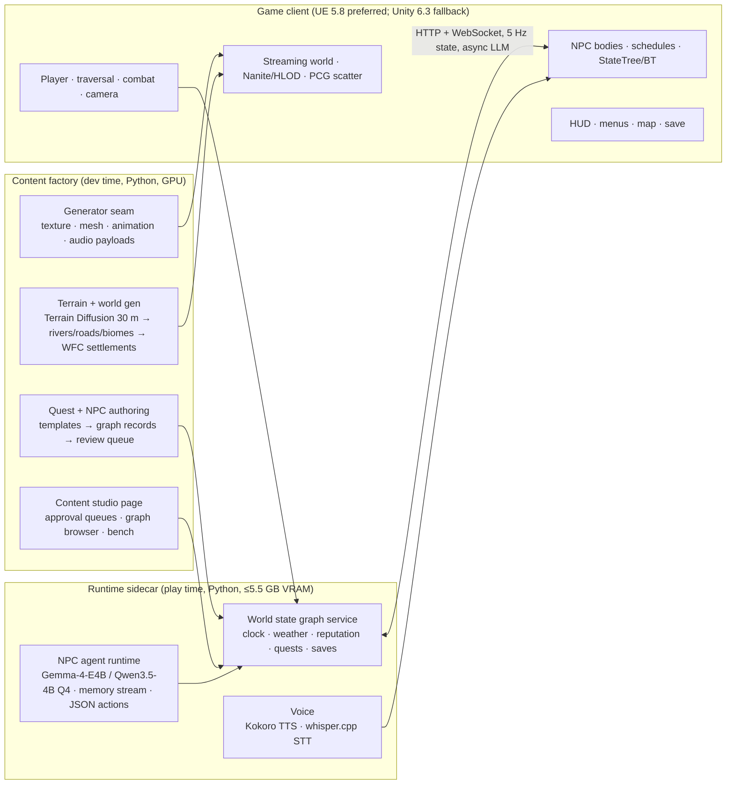

# RealmWeaver: Emberfall (working title) — Game Design and Production Plan

Date: 2026-10-06. Status: self-approved under the user's autonomy instruction; assumptions marked *(assumed)*. Sources: `docs/research/06-crimson-desert-study.md` (Crimson Desert, 127-item inventory), `07-generative-game-stack-2026.md` (stack), `docs/review/2026-10-06-architecture-review.html` (engine deepening order). Vocabulary: `GLOSSARY.md` (extended in §8).

## 0. Honest framing

Crimson Desert: ~200 people, ~7 years, a proprietary engine, 90 km², 80 bosses, 535 weapons, 430 side adventures. This plan targets a **Crimson-Desert-like** single-player open-world action RPG at roughly one quarter of that scale, built by 1–3 people plus an agent fleet, with generative pipelines producing bulk content that humans curate. Everything that is not measured stays a target. The plan is staged so that each milestone is a playable, shippable artifact on its own.

## 1. Vision

A finite single-player adventure across a hand-shaped, machine-filled continent where exploration is the gameplay: if you can see it you can reach it, every settlement has NPCs that live their own schedules and talk back through local language models, and the world keeps one shared state (time, weather, damage, reputation). Combat is expressive and physical, not punishing.

## 2. Pillars (Crimson Desert's, translated into our constraints)

1. **Exploration is the gameplay.** World built first; quests layered on. Silhouette-first landmarks every ~300 m (CD: 780 landmarks on 90 km²).
2. **If you can see it, you can go there.** Climb-anything with stamina, glide, grapple, swim, mounts.
3. **One shared world state.** Time, weather, fire, destruction, NPC memory and faction standing in the world state graph, persisted and reproducible.
4. **Expressive combat.** Light/heavy strings, timed parry, dodge, grapple suite, stagger bars, elemental imbues; three difficulty modes; never a Souls-like.
5. **A living world with purpose.** Every NPC has a schedule, a memory and a reason to exist; agentic dialogue is grounded in the graph, never free-floating.
6. **Physics and interaction as foundation.** Destructible props, fire spread, throwable enemies — scoped to what the chosen engine does out of the box.
7. **Measured, not claimed** (carried over from the MVP): frame time, load time, generation throughput and content counts are benchmark outputs.
8. **Generate bulk, curate the spine.** Main chapters, bosses and key NPCs are authored; biomes, props, side adventures and filler NPCs are generated and reviewed.

## 3. Scope tiers (each milestone is playable)

| Milestone | Target window *(assumed)* | World | Content | Systems gate |
|---|---|---|---|---|
| **M0 Engine ready** | +4 weeks | 1 km² test region, 3D | 50 generated meshes, 1 character, 5 NPCs | payload-typed Asset seam, 3D asset + terrain pipelines, NPC agent runtime, engine client streaming 3D |
| **M1 Vertical slice** | +3 months | 1 region, ~4 km² | 1 chapter (5 main + 10 side quests), 3 enemy archetypes, 1 boss, 12 NPCs, 2 weapon categories | traversal core, combat core, day/night + weather, save/load, minimal HUD, dialogue via agents |
| **M2 Alpha** | +9 months | 3 regions, ~12 km² | 4 chapters, 10 bosses, 60 side adventures, 5 weapon categories, 40 NPCs | skills/artifacts, mounts, glider/grapple, crafting/cooking, factions + reputation, map/fog, fast travel, stealth-lite |
| **M3 Beta** | +15 months | 5 regions, ~25 km² | 8 chapters, 20 bosses, 120 side adventures, 8 weapon categories, 100 NPCs | camp/base, trading, liberation/siege-lite, mini-games ×3, puzzles/dungeons, accessibility, localization scaffold |
| **M4 Release 1.0** | +18–24 months | same | polish | performance tiers, QA, store, legal/licensing, achievements |

Scale ratio vs Crimson Desert at 1.0: map ≈ 1/4, bosses ≈ 1/4, weapons ≈ 1/5, side content ≈ 1/4, chapters 8 vs 12. Hours: 20–30 main, 40–60 complete *(assumed)*.

## 4. Systems inventory → epics (every Crimson Desert system placed, scaled, or cut)

Legend: **M1/M2/M3** = milestone where it lands; **gen** = produced by a generative pipeline then curated; **cut** = out of scope for 1.0 with reason. Numbers in brackets are the inventory ids from `06-crimson-desert-study.md`.

### E1 Engine evolution (Python `realmweaver`)
- Payload-typed `Asset` (texture / mesh / animation / audio) behind the one `Generator` seam [arch C1] — M0.
- `World` behind a region map; `request_chunk` reports its own transition [C3] — M0.
- In-flight runner inside `World` (inline + worker-per-slot adapters), bridge reduced to routes + event fan-out [C5] — M0.
- One wire module for chunk/region JSON, events and engine DTOs [C8] — M0.
- Record-driven world state graph schema (write/validate/JSON from one definition) [C4]; adds Region3D, NPC, Quest, Faction, Event node types — M0/M1.
- Biome as one compiled record (tileset, prompts, palette, 3D props, climate) [C6] — M0.
- Predictor/Scheduler geometry from `World` [C7] — only when the 3D region geometry exists (second adapter) — M1.

### E2 3D asset pipeline (gen)
- Text/image → mesh with PBR textures (model per `07-…` stack rec), watertight check, decimation to LOD0–LOD2, UV/texture 1k/2k, collision proxy, GLB export — M0 [1, 15].
- Tileable terrain textures from the existing SD1.5 path, 2k, with normal/roughness via a PBR-from-albedo model — M0.
- Prop families per biome: rocks, trees (100 species in CD → 12 for us), ruins, furniture, loot containers, weapons (535 in CD → ~100 generated, 30 curated hero items) — M1–M3 [44].
- Style gate: DINO coherence per biome + manual approval queue in the operator page — M0.
- Import automation into the engine project (headless), naming `Prefab_<class>` kept — M0.

### E3 Terrain and world generation (gen + authored spine)
- Heightmap per region: noise + hydraulic erosion + authored macro-shape; rivers/lakes/coast; roads/paths graph; cliffs for climbing [15, 20] — M0/M1.
- Biome assignment by climate (temperature/moisture/elevation), 5 regions + 1 "Abyss"-like alternate layer [3] — M1 (1 region), M2 (3), M3 (5).
- Landmark placement: silhouette-first, one per ~300 m, categories (ruin, tower, cave, shrine, camp, village) [15] — M1.
- Settlement generation: WFC/graph grammar for villages/towns on top of the existing WFC (lots, roads, buildings as prefabs) — M1.
- Caves and underground (3 vertical layers in CD → 2 for us: surface + caves; sky islands in M3) [2, 109, 111] — M2/M3.
- Vegetation/rock scatter with density maps, LOD/impostors [1] — M0.
- Streaming: 256 m sectors (CD) → engine-native streaming cells 256 m; prewarm predictor reused for 3D cells — M0.
- Fog-of-war map, bells/towers reveal, map filters/search [14] — M2.

### E4 Game client foundation (engine project)
- Engine project skeleton, input (gamepad + KBM), third-person camera with collision, soft/hard lock-on modes [78] — M0/M1.
- Save Anytime (3 autosaves + 9 manual), safe relocation on load, world-state snapshot = graph JSON + engine save [119] — M1.
- Streaming cells, LOD, impostors, occlusion; performance budget per tier — M0.
- Bridge v2: gRPC/WebSocket to the Python runtime for generation, NPC turns and world-state sync (`07-…` protocol rec) — M0.
- Settings: graphics tiers, upscalers as available in the engine, accessibility toggles [117, 121] — M2/M3.

### E5 Character and traversal
- Third-person character controller: run, sprint, jump, double jump, vault, ledge grab; stamina model shared with climbing/swimming/gliding [20, 21, 24] — M1.
- Free climbing on tagged surfaces with stamina drain, slip on wet surfaces (weather link) [20] — M1 (basic), M2 (any surface).
- Glider with descent-only physics and wind influence [22, 7] — M2.
- Grapple/force pull: anchor swing + object pull (telekinesis-lite); enemy pull in M3 [23] — M2/M3.
- Swimming with drowning on empty stamina; diving cut (CD cut it too until DLC) [24] — M1.
- Horse: taming mini-game (mash/rhythm), summon whistle, trust levels 1–3 (CD 1–5), mounted combat M3 [26, 32] — M2.
- Exotic mounts (CD 29): 3 for us (bear, wyvern with timed flight, lizard) [27] — M3; mechanical mounts **cut** (scope).
- Vehicles: wagon only (caravan hijack hook for quests) [29] — M3; boats/balloons **cut**.
- Fast travel plates + puzzle-gated shrines; blocked when mounted/in combat/swimming [30] — M2.
- Consumable wheel usable mid-action [25] — M2.

### E6 Combat
- Core loop: light/heavy strings per weapon category, stamina-free lights, timed parry with counter window and resource refund, unblockable red attacks, perfect dodge [67, 68, 69] — M1.
- Stagger/super-armour model, multi-bar bosses, finishers [71, 72] — M1 (model), M2 (finishers).
- Grapple suite: pin, throw, slam (CD has 7 moves → 3 in M2, 5 in M3) [70] — M2/M3.
- Elemental imbue dial (fire/lightning/ice) with burn/stagger/slow and terrain spread via E11 fire [73] — M2.
- Spirit-fuelled active skills: 4 in M1, 12 in M2, 24 in M3 (CD 80 per character) [74] — M1+.
- Ranged kit: bow (M2), one firearm type (M3) [75].
- Environmental combat: throw into props/cliffs, explosive barrels, collapsing scaffolds [76] — M2.
- Lock-on soft/hard, camera modes, control presets, three difficulty modes [78, 79, 80] — M1 (lock-on), M2 (presets), M3 (difficulty tuning pass).
- Enemy archetypes: bandit, elite parrier, pack hunter in M1; warlord, heavy beast, colossal weak-point creature, undead, formation goblins by M3 (CD 8+) [81]; behaviour trees + utility scoring, agentic taunts via E7.
- Bosses: 1 (M1), 10 (M2), 20 (M3) incl. 1 climb-and-destroy colossus and 1 illusion-clone duelist (CD 75–80) [82]; boss death menu (revive/retry/give up) [83]; rematch mode **cut** (announced-only in CD).
- Sieges with allied squads and destructible gates: one scripted siege per region in M3 [85]; base liberation with world-state rebuild (phase-switched prefabs) for camps/outposts [86, 13] — M2 (2 types), M3 (4 types); re-blockade **cut**.

### E7 Agentic NPCs (the differentiator)
- NPC record in the world state graph: identity, role, faction, home/work places, schedule, inventory, relationships, memory stream, goals [17, 18] — M0.
- Daily schedules driven by the world clock (wake/work/sleep, shop hours, rain sheltering) executed by the engine; schedule authored by the Python runtime from templates per role — M1.
- Agent runtime (Generative-Agents pattern): memory stream with importance, reflection, planning; local LLM (model per `07-…`), structured tool calls (`say`, `give`, `offer_quest`, `refuse`, `report_crime`), per-turn latency budget, cache of common lines, hard grounding: every fact in a reply must trace to a graph node or the NPC's memory (verifier step) — M0 (runtime), M1 (12 NPCs), M2 (40), M3 (100).
- Dialogue UI with limited binary choices affecting faction standing; no ending branches (CD) [96] — M1.
- Reputation: five tiers per faction with crime-driven decay; faction-gated merchants and areas [97, 66] — M2.
- Crime/law loop: witnesses, detection zones, bounty state, guards, jail, pardon writ; disguise mask [98, 99] — M2 (detection + bounty), M3 (jail/pardon/disguise).
- Voice: local TTS for key lines, text for the rest; lip-sync **cut** for 1.0 [123] — M2.
- Safety: profanity/injection filters on player input, NPC knowledge boundaries, no real-person likeness — M0.

### E8 Quests and narrative
- Quest graph in the world state graph: nodes Quest/Objective/Condition/Reward, state machine, journal with reward previews [101] — M1.
- Main campaign: prologue + 8 chapters + epilogue (CD 12), authored; chapter 1 in M1, 4 by M2, 8 by M3 [88].
- Side adventures (CD 430 → 120): template families (escort, hunt, fetch-with-twist, investigation, rescue, delivery, rumour) generated from graph facts, each reviewed by a human before shipping [89, 95] — gen, M1 (10), M2 (60), M3 (120).
- Commission boards, bounty hunting (outlaw NPCs with agent personalities) [90, 91] — M2.
- Investigation/contradiction dialogue puzzles: 3 in M2, 8 in M3 [92].
- Faction questlines: 3 factions × 4 quests in M2, 5 × 8 in M3 (CD 186–280 quests) [89].
- Lore codex (CD 2,921 entries → 300), memory-fragment visions as short cutscenes [40, 100, 124] — M3.
- Real-time cutscenes inheriting time/weather, 15 key scenes authored; voice for main cast only (CD 70+ actors; ours TTS + 2–4 human actors if budget) [19, 123] — M2/M3.

### E9 Progression and equipment
- Three core stats raised by artifacts; no XP levels; kill gauge paying artifacts [33, 34, 35] — M2.
- Skill tree per character: 24 skills with ranks (CD ~80); watch-and-learn for 6 enemy moves [36, 37] — M2; story-gated skills [38] — M3.
- Second playable character with instant switch (CD 3) — M3 [42]; third **cut**.
- Challenges: 60 (CD 350) across exploration/combat/life skills [41] — M3.
- Weapons: 8 categories at 1.0 (CD 14): sword, greatsword, spear, axe, dagger, bow, shield off-hand, one firearm; quick-swap slot [44, 45, 46] — M1 (2), M2 (5), M3 (8).
- Armour sets, cloaks with resistances, cosmetic sets; dye **cut** [47, 52].
- Slot inventory 50→150 with bags; chests at camp [48, 49] — M1 (50), M2 (bags), M3 (chests).
- Refinement +1…+6 (CD +10), socket cores 2 types + boss cores [50, 51] — M2/M3.

### E10 Economy, camp, life skills
- Currencies: copper/silver only (CD adds gold bars, camp funds); vendors per region with faction gating [62, 66] — M2.
- Gathering with proficiency: mining, herbalism, logging, fishing (hunting via combat) [55] — M2.
- Cooking at any fire: free-form combos, 20 recipes, 3 quality tiers (CD 40+/4) [53]; alchemy 6 potions [54] — M2.
- Workstations: forge (gear), loom **cut** [56] — M3.
- Camp base: recruit roster (8 recruits), 3 facilities with 2 upgrade tiers, dispatch missions (solo only) [57, 58, 59] — M3; farming/ranching/housing **cut** for 1.0 [60, 61].
- Trading: regional trade goods and caravans, black market for stolen goods [63, 64] — M3; contribution shops [65] — M3.

### E11 World simulation
- Clock + calendar, sleep/time-skip, day/night lighting [5] — M1.
- Weather by biome/elevation/time: rain, snow, fog, sandstorm; fog lowers detection [4, 8] — M1 (rain/fog), M2 (all), temperature gauge with gear/food resistances [6] — M2.
- Wind affecting vegetation, cloth and glide [7] — M2.
- Fire propagation on flammable materials, burning enemies [11] — M2.
- Destruction of tagged props by applied force; towers/walls in sieges only [10] — M2 (props), M3 (siege structures).
- Night-only/weather-conditional spawns [16] — M2; gimmick objects (levers, barrels, totems) data-defined [12] — M1.
- Ocean/water: shallow water + swim volumes; FFT ocean **cut** [9].
- Dynamic events: ambushes, caravans, animal migrations — 6 types by M3 (CD "world events").

### E12 Activities, puzzles, stealth
- Mini-games: card game (one ruleset), arm wrestling, archery contest (CD 6+) [103, 104, 105] — M3; gambling dens **cut**.
- Rule-limited duels (boxing) [106] — M3.
- Fishing and hunting loops feeding cooking [107] — M2.
- Ruins puzzles: 12 (CD 37) with shrine reward [108] — M2 (4), M3 (12); sky-island puzzles 8 (CD 40) [109] — M3.
- Sanctum dungeons: 3 hand-made + 6 generated layouts (WFC rooms) [110] — M3.
- Caves: 30 (CD 100+) generated with ores/murals/chests [111] — M2 (10), M3 (30).
- Sealed-artifact shrine challenges 20 (CD 141) [112] — M3.
- Pets: one shoulder pet with auto-loot [113] — M3.
- Stealth: LOS/proximity detection, vision cones on minimap, crouch, first-strike bonus [114] — M2.

### E13 UX and presentation
- Minimal-by-option HUD, element dial, consumable wheel, temperature gauge, stamina/spirit bars [115] — M1 (bars), M2 (wheel/dial), M3 (gauge).
- Menus: inventory tabs + persistent sort, map with filters/search/markers, skill tree, journal, codex [116] — M1 (inventory/map/journal), M2 (skills), M3 (codex).
- Accessibility: colourblind palettes, chromatic-aberration toggle, photosensitive mode, remapping, subtitle sizing [117] — M3.
- Photo mode [118] — M3.
- Audio: adaptive music states (explore/combat/boss), ambience per biome/weather, SFX library; score 20 tracks (CD 75) — M2 (states), M3 (full).
- Localization scaffold: string tables, 2 UI languages at 1.0 (CD 15) [120] — M3.
- Operator page evolves into the **content studio**: approval queues for generated meshes/quests/NPC lines, world graph browser, benchmark dashboards — M0+.

### E14 Content production pipeline (the factory)
- Generation jobs as graph records with provenance (model, seed, prompt, reviewer, licence) — M0.
- Review queues with accept/reject/regenerate and style gates (DINO coherence, tileability, mesh validity) — M0.
- Batch tools: `realmweaver gen-props --biome X --n 50`, `gen-quests --region R --n 20`, `gen-npcs --town T` — M1.
- Benchmarks extended: meshes/min, NPC turn latency p50/p95, quest validity rate, frame time p50/p99 in a scripted walk (Unity/engine performance test) — M0/M1.
- Dataset hygiene: every generated asset logged; CC/licence check per model; opt-out of any gated or non-commercial model on the default path — M0.

### E15 Platform and release
- Windows build pipeline from CI (headless engine build), nightly playable; Mac/consoles **cut** for 1.0 [122].
- Performance tiers: low/mid/high presets, target 60 fps mid-tier at 1080p on an RTX 3060 *(assumed)*; upscaler integration as provided by the engine [121].
- Save/cloud: Steam Cloud, achievements (20) [119, 125].
- Legal: model licences, generated-content disclosure, no real-person likeness in characters, music rights; Steam page, trailer (made from in-engine capture, not a pitch video) — M4.
- Modding: none official (CD has none) [126].
- Expansion content (naval, underwater, housing) **cut** [127].

### E16 Production and governance
- Wayfinder map on GitHub Issues with epics E1–E16 as parents; decision tickets first, build tickets after decisions; one map per milestone.
- Cadence: weekly bench + review on the integration branch; two-axis code review per PR; ADR for every engine/model switch; monthly playtest of the current milestone build.
- Cost tracking: GPU hours, cloud spend, agent token spend per epic in the benchmark report; stop-loss per epic.
- Human roles: creative lead (spine content, approvals), technical lead (engine + runtime), optional artist/animator part-time; agent fleet for generation, implementation, review, QA scripts.

## 5. Technical architecture

Three processes, one source of truth:

**Decisions (each gets an ADR when confirmed):**
- **Engine**: Unreal Engine 5.8 after a two-week spike (≥60 fps at 1080p with 2,000 Nanite props + PCG foliage in ≤6 GB VRAM; cook <30 min; bridge port <1 week). Fallback Unity 6.3 LTS (keeps `unity/com.realmweaver.client`). Godot for tooling only. **Owner decision** (both main options need an Epic/Unity account the agent cannot create).
- **3D assets**: `microsoft/TRELLIS.2-4B` (MIT) via ComfyUI on Windows at 512³ locally (~8 GB, ~1 min), 1024³ on a 24 GB cloud GPU; `VAST-AI/TripoSG` (MIT) for watertight deformables; SPAR3D only for dev-time placeholders that never ship (gated, revenue-capped). Hunyuan3D-2.1 **excluded** from shipped assets (licence forbids output use in the EU/UK/Korea; see `10-licence-audit.md`). TRELLIS.2 runs with its gated RMBG-2.0 background remover swapped for `ZhengPeng7/BiRefNet` (MIT) and nvdiffrast kept out of the production environment.
- **Terrain**: `xandergos/terrain-diffusion-30m` (MIT): seed-consistent random-access heightmaps + climate → Python post-pass (rivers, roads, Whittaker biomes, WFC/MarkovJunior settlements → world graph) → optional Gaea 2 erosion for hero regions → engine landscape tiles + PCG masks. The existing predictor/prewarm model applies unchanged to 3D cells.
- **Characters/animation**: MetaHuman for humans; TRELLIS.2 + UniRig (MIT) for creatures; IK retargeting; Mixamo + the Game Animation Sample motion-matching database; bespoke clips from mocap or hand animation only — `tencent/HY-Motion-1.0` is **excluded** (regional licence, undisclosed training data). Hard rule: no AMASS/HumanML3D-trained generators in a commercial build.
- **NPC runtime**: llama.cpp `llama-server` with `Qwen/Qwen3.5-4B` Q4_K_M (Apache-2.0; ~2.7–3.5 GB resident at ≤4K context with q8 KV) — A/B `google/gemma-4-E4B-it` (Apache-2.0, larger on disk); JSON-schema actions validated against the graph; Kokoro-82M TTS, Chatterbox-Turbo for named voices, whisper.cpp STT. Budget: ~1 s per 60-token turn on the laptop; cache of common lines; grounding verifier before any line reaches the player.
- **Bridge**: keep HTTP + WebSocket (ADR-0003); engine-native WebSocket client; reader thread, ≤1 ms/frame main-thread apply; player state 5 Hz, agent decisions 1–5 Hz, LLM async. gRPC only if profiled.
- **Pre-bake vs live**: pre-bake meshes, PBR, collision, terrain, splat masks, layouts, rigs, clips, personas, authored dialogue, voice banks. Live: LLM dialogue, TTS for unscripted lines, CPU WFC micro-layouts, chunk scheduling. Diffusion and 3D generation never run in a player build.
- **Spec tiers** (resolved in #34, `docs/research/11-min-spec-proposal.md`): Minimum 6 GB GPU with the LLM off (authored lines + baked voice bank); Recommended RTX 3060-class 12 GB with the 4B LLM resident; Showcase 16 GB. LLM, TTS and STT share one sidecar process.
- **VRAM at play (12 GB)**: game ≤6.0 GB · LLM 3.5 GB · TTS 0.5 GB · STT 0.5 GB · headroom 1.5 GB.
- **Data model**: the world state graph gains node types Region3D, Settlement, Landmark, NPC, Memory, Quest, Objective, Faction, Event, Save; one record schema drives write/validate/JSON (arch C4); every generated artifact carries provenance (model, licence, seed, prompt, reviewer).

## 6. Risks and stop-losses

| Risk | Signal | Response |
|---|---|---|
| Engine spike fails the budget (fps/VRAM/cook) | spike report after 2 weeks | fall back to Unity 6.3; keep PCG/Nanite-specific work out of M0 |
| Generated meshes look incoherent together | DINO style gate pass-rate < 70% per biome | tighten prompts per biome, add a style LoRA on the image stage, curate hero props by hand |
| NPC dialogue hallucinates quests/items | grounding verifier reject-rate > 20% | restrict action schema, add retrieval of graph facts, fall back to authored lines |
| LLM latency ruins conversation feel | p95 turn > 2.5 s on target hardware | smaller model (2B), speculative first sentence, pre-generated greetings |
| Content volume outruns review capacity | approval queue > 2 weeks old | lower generation batch size; quests ship only after review, never auto |
| Licence/regional exclusions | any model with regional limits on the default path | tagged fallbacks only; licence check in CI for provenance records |
| Scope creep toward the 127-item list | milestone slips > 4 weeks | cut the next lowest-value M3 item; M1 never grows |

## 7. Testing decisions

- Python: tests at seams only — `Generator.generate` per payload kind (mesh validity: watertight, triangle budget, UV coverage), terrain post-pass (rivers flow downhill, roads connect settlements, biome share per climate), quest templates (every generated quest has reachable objectives and a reward in the graph), NPC runtime (action JSON validates, grounding verifier catches an injected false fact, schedule covers 24 h), graph records (schema round-trip), bridge contract (fixture-exact).
- Engine: automated functional tests in the engine's test framework for traversal (climb a tagged wall, glide descends), combat (parry window, stagger bar), save/load round-trip; scripted-walk performance test producing frame time p50/p99 into the benchmark report.
- Content QA: every shipped side adventure and NPC persona has a reviewer id in provenance; nightly build + 30-minute scripted playthrough with crash and soft-lock detection.
- Playtests: monthly, five players, 60-minute sessions, written findings as tickets.

## 8. Glossary additions

Region3D (a biome-assigned terrain tile set, 256 m cells) · Landmark (silhouette-first point of interest) · Settlement (WFC/grammar-generated village/town) · Persona (an NPC's identity, goals, voice and memory seed) · Memory stream · Grounding verifier (checks every NPC statement against graph facts) · Action schema (JSON tool calls an NPC may emit) · Provenance record · Review queue · Spine content (authored main chapters, bosses, key NPCs) · Bulk content (generated, reviewed) · Milestone build.

## 9. Phase 0 — what starts now (no engine needed)

1. Engine evolution E1: payload-typed `Asset`, World behind a region map, runner inside World, one wire module, record-driven graph (arch C1→C3→C5→C8→C4).
2. 3D asset spike: TRELLIS.2-4B at 512³ on the laptop → GLB with PBR → validity metrics → operator page preview (E2).
3. Terrain spike: terrain-diffusion-30m → heightmap + climate for a 4 km² test region → rivers/roads/biomes → graph (E3).
4. NPC agent runtime spike: local 4B model via llama.cpp, memory stream, JSON actions, grounding verifier, 5 personas in a text harness; latency and reject-rate measured (E7).
5. Content studio: approval queues and provenance in the operator page (E13/E14).
6. Owner: choose engine (UE 5.8 spike vs Unity 6.3), create the engine account/project, decide cloud GPU budget for 1024³ meshes and motion clips.

## 10. Open decisions (wayfinder tickets)

Engine (owner) · cloud GPU budget (owner) · art direction and reference board (owner, impeccable new-work) · playable character concept (owner) · which 5 biomes/regions and their climates · main antagonist and chapter outline (spine) · voice strategy (TTS-only vs actors) · difficulty philosophy · minimum spec tier · whether M2 includes a second playable character.
